# SwiftUI

**You MUST use this skill for ANY SwiftUI work including views, state, navigation, layout, animations, architecture, gestures, and debugging.**

<!-- AXIOM_AUDITOR_INLINE_BEGIN — auto-maintained by scripts/build-inlined-auditors.ts; do not hand-edit -->
> **Not on Claude Code?** Where this router says "Launch `some-auditor` agent", read that auditor's file in this suite and follow it inline — the same procedure, needing only file search and read.
>
> Available here: `skills/swiftui-architecture-auditor.md`, `skills/swiftui-layout-auditor.md`, `skills/swiftui-nav-auditor.md`, `skills/swiftui-performance-analyzer.md`, `skills/textkit-auditor.md`, `skills/ux-flow-auditor.md`.
> Homed in another suite: `axiom-design/skills/liquid-glass-auditor.md`.
>
> Agents that need Bash — builds, tests, simulators, crash symbolication — stay Claude Code-only; there is no inline equivalent for those.
<!-- AXIOM_AUDITOR_INLINE_END -->

## Quick Reference

| Symptom / Task | Reference |
|----------------|-----------|
| View not updating | See `skills/debugging.md` |
| View update still broken after debugging | See `skills/debugging-diag.md` |
| Slow previews / building good previews / `@Previewable` / `PreviewModifier` / variant matrix | See `skills/previews.md` |
| Preview API reference (`#Preview`, traits, modes, Development Assets) | See `skills/previews-ref.md` |
| Preview crashes / won't load | See `skills/debugging.md` (Preview Crashes section) |
| Hot reload / live editing / edit the running app on device | See `skills/hot-reload.md` |
| Navigation issues | See `skills/nav.md` |
| Navigation still broken after debugging | See `skills/nav-diag.md` |
| Navigation API reference | See `skills/nav-ref.md` |
| Layout breaks on iPad/rotation | See `skills/layout.md` |
| State lost on resize/rotation (scroll, selection, focus, drafts) | See `skills/layout.md` (State Survives the Transition) |
| Layout API reference | See `skills/layout-ref.md` |
| Performance/lag/slow scroll | See `skills/swiftui-performance.md` |
| Architecture/testability | See `skills/architecture.md` |
| `@State` object rebuilt every view init, or an `init` assignment ignored at runtime | See `skills/architecture.md` (`@State` is a macro now) |
| Animation issues | See `skills/animation-ref.md` |
| Stacks/grids/outlines | See `skills/containers-ref.md` |
| Custom containers / List replacement (iOS 18+) | See `skills/containers-ref.md` Part 7 |
| Search implementation | See `skills/search-ref.md` |
| Toolbars, ToolbarItem, sheet button placement, customization | See `skills/toolbars.md` |
| Sheets, detents, popovers, fullScreenCover, presentation adaptation | See `skills/presentations.md` |
| Multi-column Table, sortable/resizable columns (iPad/Mac; collapses to first column in compact) | See axiom-macos (skills/swiftui-differences.md) |
| Inspector panel (`.inspector` — trailing column in regular width, sheet in compact) | See axiom-macos (skills/swiftui-differences.md) |
| Gesture conflicts | See `skills/gestures.md` |
| Section index — the vertical A–Z index strip / alphabet scrubber on a list's trailing edge, jump-to-section | See `skills/26-ref.md` (Section Index) |
| List section margins / insets around a `Section` | See `skills/26-ref.md` (Section Margins) |
| Web content — `WebView` / `WebPage`, scroll modifiers, WebView-in-NavigationStack | See `skills/26-ref.md` (WebView & WebPage) |
| iOS 26 features | See `skills/26-ref.md` |

## Non-SwiftUI UI Routes

These topics are part of the broader iOS UI domain but live in separate suites:

#### UIKit issues
- Auto Layout conflicts → See axiom-uikit (skills/auto-layout-debugging.md)
- Animation timing → See axiom-uikit (skills/uikit-animation-debugging.md)
- SwiftUI ↔ UIKit bridging → See axiom-uikit (skills/uikit-bridging.md)

#### Design & guidelines
- Liquid Glass adoption → See axiom-design (skills/liquid-glass.md)
- SF Symbols → See axiom-design (skills/sf-symbols.md)
- HIG compliance → See axiom-design (skills/hig.md)
- Typography → See axiom-design (skills/typography-ref.md)
- TextKit/rich text → See axiom-uikit (skills/textkit-ref.md)

#### Other
- tvOS (focus, remote, text input) → See axiom-swift (skills/tvos.md)
- App-level composition (root, auth, scenes) → See axiom-design (skills/app-composition.md)
- Drag/drop, sharing, copy/paste → See axiom-swift (skills/transferable-ref.md)
- VoiceOver, Dynamic Type → `/skill axiom-accessibility`
- UI test flakiness → `/skill axiom-testing`
- UX dead ends, dismiss traps → Launch `ux-flow-auditor` agent

#### watchOS-specific patterns
- Glanceable UI, watch navigation, Smart Stack widgets → See axiom-watchos

## Conflict Resolution

**axiom-swiftui vs axiom-performance**: When UI is slow (e.g., "SwiftUI List slow"):
1. **Try axiom-swiftui FIRST** — Domain-specific fixes (LazyVStack, view identity, @State optimization) often solve UI performance in 5 minutes
2. **Only use axiom-performance** if domain fixes don't help — Profiling takes longer and may confirm what domain knowledge already knows

## Decision Tree

```dot
digraph swiftui {
    start [label="SwiftUI issue" shape=ellipse];
    what [label="What's wrong?" shape=diamond];

    start -> what;
    what -> "skills/debugging.md" [label="view not updating"];
    what -> "skills/nav.md" [label="navigation"];
    what -> "skills/swiftui-performance.md" [label="slow/lag"];
    what -> "skills/layout.md" [label="adaptive layout"];
    what -> "skills/containers-ref.md" [label="stacks/grids/outlines"];
    what -> "skills/architecture.md" [label="feature architecture"];
    what -> "skills/animation-ref.md" [label="animations"];
    what -> "skills/gestures.md" [label="gestures"];
    what -> "skills/search-ref.md" [label="search"];
    what -> "skills/toolbars.md" [label="toolbars / sheet buttons"];
    what -> "skills/presentations.md" [label="sheets/detents/popovers"];
    what -> "skills/26-ref.md" [label="iOS 26 features"];
    what -> "skills/previews.md" [label="slow previews / building good previews"];
    what -> "skills/previews-ref.md" [label="preview API reference"];
    what -> "skills/debugging.md" [label="preview crashes / won't load"];
    what -> "skills/hot-reload.md" [label="hot reload / live editing"];
    what -> "axiom-macos (skills/swiftui-differences.md)" [label="Table / .inspector\n(large-window density)"];
    what -> "axiom-uikit (skills/uikit-bridging.md)" [label="UIKit interop"];
    what -> "axiom-design (skills/app-composition.md)" [label="app-level (root, auth)"];
    what -> "axiom-swift (skills/transferable-ref.md)" [label="drag/drop, sharing"];
}
```

## Automated Scanning

- Architecture audit → Launch `swiftui-architecture-auditor` agent
- Performance scan → Launch `swiftui-performance-analyzer` agent or `/axiom:audit swiftui-performance`
- Navigation audit → Launch `swiftui-nav-auditor` agent or `/axiom:audit swiftui-nav`
- Layout audit → Launch `swiftui-layout-auditor` agent or `/axiom:audit swiftui-layout`
- UX flow audit → Launch `ux-flow-auditor` agent or `/axiom:audit ux-flow`
- Liquid Glass scan → Launch `liquid-glass-auditor` agent or `/axiom:audit liquid-glass` (detects migration opportunities AND adoption-completeness gaps: variant discipline for media surfaces, glass-on-glass nesting, missing `if #available` gates, primary-action tinting, `.tabRole(.search)`; scores ADOPTED / PARTIAL / NOT ADOPTED)
- TextKit scan → Launch `textkit-auditor` agent or `/axiom:audit textkit` (detects fallback triggers, glyph APIs that corrupt complex scripts, missing Writing Tools wiring, AND architectural gaps like missing fallback observation, SwiftUI wrappers dropping TextKit 2 properties, missing `isWritingToolsActive` guards; scores MODERN / MIXED / LEGACY)

## Anti-Rationalization

| Thought | Reality |
|---------|---------|
| "Simple SwiftUI layout, no need" | SwiftUI layout has 12 gotchas. `skills/layout.md` covers all of them. |
| "I know how NavigationStack works" | Navigation has state restoration, deep linking, and identity traps. `skills/nav.md` prevents 2-hour debugging. |
| "It's just a view not updating" | View update failures have 4 root causes. `skills/debugging.md` diagnoses in 5 min. |
| "I'll just add .animation()" | Animation issues compound. `skills/animation-ref.md` has the correct patterns. |
| "No architecture needed" | Even small features benefit from separation. `skills/architecture.md` prevents refactoring debt. |
| "I know .searchable" | Search has 6 gotchas. `skills/search-ref.md` covers all of them. |
| "I'll just add a Done button" | Sheets without Cancel break the HIG (updated 2026-03-24). `.cancellationAction` / `.confirmationAction` produce HIG-correct placement automatically — `skills/toolbars.md` Pattern 2 has the rules. |
| "A sheet is a sheet, nothing to configure" | Detents, compact adaptation, background interaction, and iOS 18 sizing decide how it behaves across window shapes. `skills/presentations.md` covers the adaptation traps (landscape sheets silently become full-screen covers). |
| "Previews are slow forever, I'll just use the simulator" | Five concrete fixes in `skills/previews.md`. Rule 4 (auto-refresh off) is 30 seconds and often halves perceived slowness. |
| "`@State` is lazy in Xcode 27, I read the release notes" | Only when the property is `private`/`fileprivate`. `skills/architecture.md` has the gate, the three TN3211 breaks, and the one that compiles and is wrong at runtime. |
| "I'll just write a wrapper view for `@State` in this preview" | `@Previewable @State` (Xcode 16+) eliminates that boilerplate. `skills/previews-ref.md` has the macro signature. |
| "I'll just rebuild and relaunch every time" | Hot reload edits the running app in place, state preserved. `skills/hot-reload.md` has the InjectionNext + Inject setup and the verify-via-`xclog` loop. |
