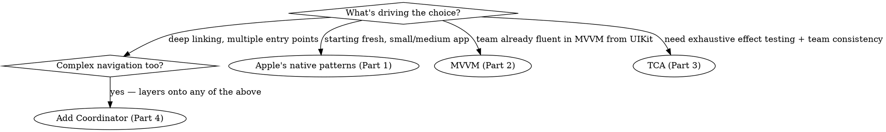
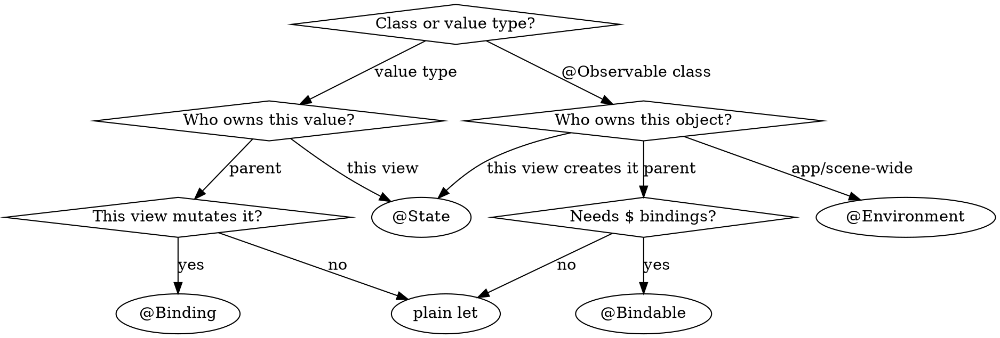
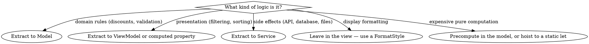

# SwiftUI Architecture

## When to Use This Skill

Use this skill when:
- You have logic in your SwiftUI view files and want to extract it
- Choosing between MVVM, TCA, vanilla SwiftUI patterns, or Coordinator
- Refactoring views to separate concerns
- Making SwiftUI code testable
- Asking "where should this code go?"
- Deciding which property wrapper to use (@State, @Binding, @Environment, @Bindable)

## Example Prompts

| What You Might Ask | Why This Skill Helps |
|---|---|
| "There's quite a bit of code in my model view files about logic things. How do I extract it?" | Provides refactoring workflow with decision trees for where logic belongs |
| "Should I use MVVM, TCA, or Apple's vanilla patterns?" | Decision criteria based on app complexity, team size, testability needs |
| "How do I make my SwiftUI code testable?" | Shows separation patterns that enable testing without SwiftUI imports |
| "Where should formatters and calculations go?" | Anti-patterns section prevents logic in view bodies |
| "Which property wrapper do I use?" | Decision tree for @State, @Binding, @Environment, @Bindable, or plain properties |

## Quick Architecture Decision Tree



| Choice | What you get | Cost |
|--------|--------------|------|
| Apple's native patterns | `@Observable` models, State-as-Bridge, property-wrapper tree | Fewest moving parts; the default |
| MVVM | ViewModels as presentation adapters | An extra layer per view that has presentation state |
| TCA | State/Action/Reducer/Store, exhaustive effect tests | Learning curve, boilerplate, third-party dependency |
| Coordinator | Navigation pulled out of views, `NavigationPath` routing | Another object to own and test |

---

# Part 1: Apple's Native Patterns (iOS 26+)

## Core Principle

> "A data model provides separation between the data and the views that interact with the data. This separation promotes modularity, improves testability, and helps make it easier to reason about how the app works."
> — Apple Developer Documentation

Apple's modern SwiftUI patterns (WWDC 2023-2025) center on:
1. **@Observable** for data models (replaces ObservableObject)
2. **State-as-Bridge** for async boundaries (WWDC 2025)
3. **Four property wrappers**: @State, @Binding, @Environment, @Bindable
4. **Synchronous UI updates** for animations

## The State-as-Bridge Pattern

### Problem

Async functions create suspension points that can break animations:

```swift
// ❌ Problematic: Animation might miss frame deadline
struct ColorExtractorView: View {
    @State private var isLoading = false

    var body: some View {
        Button("Extract Colors") {
            Task {
                isLoading = true  // Synchronous ✅
                await extractColors()  // ⚠️ Suspension point!
                isLoading = false  // ❌ Might happen too late
            }
        }
        .scaleEffect(isLoading ? 1.5 : 1.0)  // ⚠️ Animation timing uncertain
    }
}
```

### Solution: Use State as a Bridge

"Find the boundaries between UI code that requires time-sensitive changes, and long-running async logic."

```swift
// ✅ Correct: State bridges UI and async code
@MainActor
@Observable
final class ColorExtractor {
    var isLoading = false
    var colors: [Color] = []

    func extract(from image: UIImage) async {
        // This method is async and can live in the model
        let extracted = await heavyComputation(image)
        // Synchronous mutation for UI update
        self.colors = extracted
    }
}

struct ColorExtractorView: View {
    let extractor: ColorExtractor

    var body: some View {
        Button("Extract Colors") {
            // Synchronous state change for animation
            withAnimation {
                extractor.isLoading = true
            }

            // Launch async work
            Task {
                await extractor.extract(from: currentImage)

                // Synchronous state change for animation
                withAnimation {
                    extractor.isLoading = false
                }
            }
        }
        .scaleEffect(extractor.isLoading ? 1.5 : 1.0)
    }
}
```

#### Benefits
- UI logic stays synchronous (animations work correctly)
- Async code lives in the model (testable without SwiftUI)
- Clear boundary between time-sensitive UI and long-running work

The `@MainActor` is required, not decoration. Without it the model has no isolation, `extract(from:)` becomes `@concurrent`, and passing the model in fails under Swift 6 — `error: sending 'self.extractor' risks causing data races`. Annotate the model, not the method.

To flip this default for a whole target instead of annotating every model, use `.defaultIsolation(MainActor.self)` — see swift-concurrency.

A `.task` body is created by `Task.immediate` and runs **synchronously until its first `await`** — so that prefix is as safe for animation-relevant state as a button action is.

## Property Wrapper Decision Tree

Two questions settle it: **what kind of thing is it**, and **who owns it**. Value types and `@Observable` classes take different branches — `@Bindable` works only on the class side.



A parent-owned `@Observable` needs no wrapper to be observed — observation belongs to the object, not the wrapper.

`@Environment(Type.self)` injects objects. For plain values, declare a key with `@Entry`:

```swift
extension EnvironmentValues {
    @Entry var theme = Theme(accent: .blue)   // read via @Environment(\.theme)
}
```

### Examples

```swift
// ✅ @State — View owns the model
struct DonutEditor: View {
    @State private var donutToAdd = Donut()  // View's own state

    var body: some View {
        TextField("Name", text: $donutToAdd.name)
    }
}

// ✅ @Environment — App-wide model
struct MenuView: View {
    // Traps at runtime if no ancestor called .environment(account).
    // Use `@Environment(Account.self) private var account: Account?` if the
    // model is genuinely optional. There is no compile-time check either way.
    @Environment(Account.self) private var account

    var body: some View {
        Text("Welcome, \(account.userName)")
    }
}

// ✅ @Bindable — Need bindings to parent-owned model
struct DonutRow: View {
    @Bindable var donut: Donut  // Parent owns it

    var body: some View {
        TextField("Name", text: $donut.name)  // Need binding
    }
}

// ✅ Plain property — Just reading
struct DonutLabel: View {
    let donut: Donut  // Parent owns, no binding needed

    var body: some View {
        Text(donut.name)  // Just reading
    }
}
```

### `@State` is a macro now (Xcode 27) — lazy initial value, three source-compat breaks

Xcode 27 reimplements `@State` as a Swift **macro**. A declaration-site initial value is now evaluated at most once for the lifetime of the view's identity instead of on every re-instantiation. Apple's stated motivation is reference types: a `@State` object used to heap-allocate on every view init. The `private` is load-bearing.

The cost is that `@State` "now participates in initialization the same way any stored property does" (TN3211), so the compiler diagnoses patterns it used to accept. Those breaks are build-time behavior of the Xcode 27 toolchain — they bite the moment you build with the 27 SDK, at any deployment target.

#### The access-level gate

Only a `private` or `fileprivate` declaration gets the deferral. Anything wider keeps the old eager behavior, with no diagnostic either way.

| Declaration | Initial value | Memberwise init parameter |
|---|---|---|
| `@State private var m = M()` | deferred | `_m: State<M>`, defaulted |
| `@State fileprivate var m = M()` | deferred | `_m: State<M>`, defaulted |
| `@State var m = M()` (internal, package, public) | eager, every init | `m: M` |
| `@State private(set) var m = M()` | eager, every init — its getter is internal | `m: M` |

Both columns are one mechanism: the deferred form expands to `State._makeStorage({ M() })`, a closure; the eager form to `State(initialValue: M())`, an ordinary stored-property default. Dropping `private` so a parent can pass a value in through the memberwise init therefore forfeits the deferral, on top of the ownership bug it already is — use `@Binding` or `@Bindable` (Anti-Pattern 3).

#### Break 1 — assign `@State` last in a custom `init`

Assigning a `@State` before the view's other stored properties are initialized is a use of `self` before full initialization.

```swift
struct ReportView: View {
    @State private var model: Model
    let id: String
    let title: String
}

// ❌ @State assigned first
//    error: variable 'self.id' used before being initialized
//    error: 'self' used in property access '_model' before 'super.init' call
init(id: String, title: String) {
    self.model = Model(id: id)
    self.id = id
    self.title = title
}

// ✅ every non-@State stored property first, @State last
init(id: String, title: String) {
    self.id = id
    self.title = title
    self.model = Model(id: id)
}
```

TN3211 documents the ❌ form as an error, but the diagnostic does not fire on every 27 toolchain — it does not on Xcode 27.0 (27A5252f). The compiler is not a reliable gate here; order it correctly regardless.

#### The silent one — never pair an inline initial value with an `init` assignment

This **compiles** and is wrong at runtime: the inline value wins and the `init` assignment is discarded, with no diagnostic.

```swift
// ❌ body observes counter == 0, not 42
@State private var counter: Int = 0
init() { self.counter = 42 }

// ✅ omit the inline default when init supplies the value
@State private var counter: Int
init() { self.counter = 42 }
```

**Why**: the declaration's initial value already initializes the property, so `self.counter = 42` compiles as a *setter* call, not as the macro's init accessor. That setter writes through `State`'s `nonmutating set` into storage SwiftUI has not installed in the render tree yet, so the write has nowhere to land and is dropped. Omit the inline default and the property is uninitialized at that point, so the identical line compiles as the init accessor instead — and the value sticks.

#### Break 2 — no composing another property wrapper with `@State`

```
error: invalid redeclaration of synthesized property '_counter'
```

The wrapper and the macro both synthesize the same underscore-prefixed storage (and `$counter`). Remove the other wrapper — `@State @AppStorage("k") private var x = 1` is the common shape.

#### Break 3 — a deferred `@State` is renamed in the synthesized memberwise init

A struct whose stored properties are all private gets a private memberwise initializer its own extensions can call. When a `@State` takes the deferred path, its parameter there is **renamed and retyped** — `_isOn: State<Bool>`, and defaulted — instead of `isOn: Bool`. Existing call sites stop resolving:

```swift
struct FilterChip: View {
    @State private var isOn = false
    private let label: String
}
extension FilterChip {
    init(_ label: String, initiallyOn: Bool) {
        // ❌ error: incorrect argument label in call
        //           (have 'isOn:label:', expected '_isOn:label:')
        self.init(isOn: initiallyOn, label: label)
    }
}
```

**The obvious fix loses data silently.** `_isOn` is defaulted, so deleting the failing argument compiles — and discards the caller's value, leaving the declaration's `false`. Two real fixes: pass the wrapper (`self.init(_isOn: State(initialValue: initiallyOn), label: label)`), or **drop the declaration's initial value** — with nothing to defer the parameter reverts to `isOn: Bool`, required, and every existing call site compiles unchanged.

Also: generic-argument inference is slightly less flexible — write the `@State` type explicitly if inference fails.

#### Deferral scope — declaration only

The deferral covers only the initial-value expression on the *declaration*. A value you compute in a custom `init` runs on **every** re-instantiation — and `init` runs every time SwiftUI builds the view value, which for an eagerly-built `NavigationLink(title) { Destination() }` destination is once per row realized while scrolling.

```swift
// ❌ NOT deferred. Expands to the eager State(initialValue:) path even with `private`.
@State private var model: Model
init(id: String) { self.id = id; _model = State(initialValue: Model(id: id)) }

// ❌ NOT deferred, same reason.
@State private var model: Model
init(id: String) { self.id = id; self.model = Model(id: id) }

// ✅ Deferred — a declaration-site expression on a private property, no custom init.
@State private var model = Model()

// ✅ When the value must come from a parameter, no @State spelling defers it.
//    Move the work out of init entirely.
@State private var model: Model?
var body: some View {
    content.task(id: id) { model = await Model.make(id: id) }
}
```

**Seeding from an `init` parameter and getting the once-per-identity guarantee are mutually exclusive.** No spelling of `@State` reconciles them — `.task(id:)`, `onAppear`, or an `@Observable` that outlives the view is the answer. Adding `private` to a view that seeds in `init` buys nothing, and if a declaration-site default is still present it silently makes that default win (see "The silent one").

## @Observable Model Pattern

Use `@Observable` for business logic that needs to trigger UI updates:

```swift
// ✅ Domain model with business logic
@Observable
class FoodTruckModel {
    var orders: [Order] = []
    var donuts = Donut.all

    var orderCount: Int {
        orders.count  // Computed properties work automatically
    }

    func addDonut() {
        donuts.append(Donut())
    }
}

// ✅ View automatically tracks accessed properties
struct DonutMenu: View {
    let model: FoodTruckModel  // No wrapper needed!

    var body: some View {
        List {
            Section("Donuts") {
                ForEach(model.donuts) { donut in
                    Text(donut.name)  // Tracks model.donuts
                }
                Button("Add") {
                    model.addDonut()
                }
            }
            Section("Orders") {
                Text("Count: \(model.orderCount)")  // Tracks model.orders
            }
        }
    }
}
```

#### How it works
- SwiftUI tracks which properties are accessed during `body` execution
- Only those properties trigger view updates when changed
- Granular dependency tracking = better performance

## ViewModel Adapter Pattern

Use ViewModels as **presentation adapters** when you need filtering, sorting, or view-specific logic:

```swift
// ✅ ViewModel as presentation adapter
@Observable
class PetStoreViewModel {
    let petStore: PetStore  // Domain model
    var searchText: String = ""

    init(petStore: PetStore) { self.petStore = petStore }

    // View-specific computed property
    var filteredPets: [Pet] {
        guard !searchText.isEmpty else { return petStore.myPets }
        return petStore.myPets.filter { $0.name.localizedStandardContains(searchText) }
    }
}

struct PetListView: View {
    @Bindable var viewModel: PetStoreViewModel

    var body: some View {
        List {
            ForEach(viewModel.filteredPets) { pet in
                PetRowView(pet: pet)
            }
        }
        .searchable(text: $viewModel.searchText)
    }
}
```

#### When to use a ViewModel adapter
- Filtering, sorting, grouping for display
- Formatting for presentation (but NOT heavy computation)
- View-specific state that doesn't belong in domain model
- Bridging between domain model and SwiftUI conventions

#### When NOT to use a ViewModel
- Simple views that just display model data
- Logic that belongs in the domain model
- Over-extraction just for "pattern purity"

---

## Bridging Actor State to SwiftUI

Models a view body reads should be `@MainActor` — bodies render on MainActor and need synchronous access to observed state. (It's a strong default, not a language rule: an `@Observable` with no UI-facing mutable state can stay non-isolated.) Custom actors live in their own isolation domain, so the two don't connect directly.

**A proxy layer is unavoidable** when you want SwiftUI to observe state owned by a custom actor. Some boilerplate is the cost of safe non-UI concurrency.

The standard pattern: actor owns the source of truth; a `@MainActor @Observable` model holds a snapshot; the model subscribes to actor updates and publishes changes to views.

```swift
// Source of truth — lives off-main
actor InventoryStore {
    private var items: [Item] = []
    private var listeners: [UUID: AsyncStream<[Item]>.Continuation] = [:]

    func current() -> [Item] { items }

    func updates() -> AsyncStream<[Item]> {
        AsyncStream { continuation in
            let id = UUID()
            listeners[id] = continuation
            continuation.yield(items)
            // Without onTermination, `listeners` grows for the process lifetime
            continuation.onTermination = { [weak self] _ in
                Task { await self?.removeListener(id) }
            }
        }
    }

    private func removeListener(_ id: UUID) { listeners[id] = nil }

    func setItems(_ newItems: [Item]) {
        items = newItems
        listeners.values.forEach { $0.yield(newItems) }
    }
}

// Proxy for SwiftUI
@MainActor
@Observable
final class InventoryModel {
    private(set) var items: [Item] = []
    private let store: InventoryStore

    init(store: InventoryStore) {
        self.store = store
    }

    func observe() async {
        for await snapshot in await store.updates() {
            items = snapshot
        }
    }
}

struct InventoryView: View {
    @State private var model: InventoryModel

    // The view builds the model from an injected store, which a memberwise
    // init taking the model itself can't express
    init(store: InventoryStore) {
        self.model = InventoryModel(store: store)
    }

    var body: some View {
        List(model.items) { item in Text(item.name) }
            // .task, not .onAppear — it cancels on destroy and won't stack up
            // a second iteration every time the view reappears
            .task { await model.observe() }
    }
}
```

The proxy buys you:
- Safe off-main state ownership in the actor
- SwiftUI-compatible observable surface on MainActor
- Decoupling — the actor doesn't know SwiftUI exists; the model doesn't know about non-UI consumers

The cost is the proxy code itself, which scales linearly with the number of actor-owned subsystems you need to surface. There's no way to eliminate this without giving up either actor isolation or SwiftUI's observability model.

### The reverse direction: model → `AsyncSequence` `OS26`

`Observations` turns an `@Observable` into an `AsyncSequence`, which is how non-UI consumers watch UI state without SwiftUI:

```swift
@MainActor
func indexQueries(_ model: SearchModel) async {
    for await query in Observations({ model.query }) {
        await Indexer.shared.record(query)
    }
}
```

It does **not** replace the proxy above. `Observations.init` takes a synchronous closure and tracks `@Observable` types, so it can neither `await` an actor nor observe one.

---

## `.task` Modifier Lifecycle

The `.task` modifier is the canonical way to attach async work to a SwiftUI view. Its cancellation timing is the most common source of confusion because it does NOT match what developers usually assume.

### When `.task` cancels

`.task` cancels when the **view is destroyed, or changes identity**. Specifically:

| Event | Does `.task` cancel? |
|-------|----------------------|
| State change re-evaluates view body | **No** — body re-evaluation does NOT destroy the view |
| Conditional branch flips (`if condition { ... } else { ... }`) | **Yes** — the un-rendered branch's views are destroyed |
| View is popped from `NavigationStack` | **Yes** — destruction |
| Parent removes the view from its hierarchy | **Yes** — destruction |
| Sheet/popover is dismissed | **Yes** — destruction (when the sheet view goes away) |
| App backgrounds | **No** — destruction is a view-tree event, not app lifecycle |
| `.id()` value changes, or `ForEach` identity churn | **Yes** — identity change, not destruction |

```swift
struct ContentView: View {
    @State private var counter = 0

    var body: some View {
        VStack {
            Button("Increment") { counter += 1 }
            DataView()
                .task {
                    // ✅ Runs once when DataView first appears
                    // ❌ Does NOT restart when `counter` changes — DataView is reused
                    await loadData()
                }
        }
    }
}
```

State changes that re-evaluate the body keep the same view identity. `.task` is tied to view identity, not body evaluation. If you want the task to restart on a value change, use `.task(id:)`:

```swift
DataView(id: selectedID)
    .task(id: selectedID) {
        // ✅ Cancels and restarts whenever selectedID changes
        await loadData(id: selectedID)
    }
```

### When you need fine-grained cancellation

SwiftUI does not expose the `Task` handle that `.task` creates. If you need to cancel based on a signal that isn't view destruction (e.g., user taps a "stop" button, network condition changes, a model state requires aborting), own the Task yourself:

```swift
struct DownloadView: View {
    @State private var downloadTask: Task<Void, Never>?

    var body: some View {
        VStack {
            Button("Cancel") { downloadTask?.cancel() }
        }
        .onAppear {
            downloadTask = Task {
                await performDownload()
            }
        }
        .onDisappear {
            downloadTask?.cancel()  // Required — view destruction won't cancel manual tasks
        }
    }
}
```

This pattern recreates `.task`'s "cancel on view destruction" behavior via `onAppear` + `onDisappear`, while also exposing the handle for explicit cancellation.

### `.task(id:)` Pitfalls

The `.task(id:)` variant restarts when the `id` value changes by `Equatable` comparison. Three specific failure modes:

**Equality-stuck repeated assignment.** Assigning the *same* value to your `id` doesn't trigger a restart, because `oldValue == newValue` returns true. This bites refresh buttons that use a sentinel:

```swift
@State private var refreshFlag = false

// ❌ Second tap is a no-op — refreshFlag is already true
Button("Refresh") { refreshFlag = true }
    .task(id: refreshFlag) { await load() }

// ✅ Use a monotonically increasing token so every action produces a new value
@State private var refreshToken = UUID()
Button("Refresh") { refreshToken = UUID() }
    .task(id: refreshToken) { await load() }
```

A common workaround is `.toggle()` to force a value change, but that couples the Bool's semantics to a flag-flipping protocol and breaks if any other code path also writes to the flag. `UUID()` or an incrementing `Int` is unambiguous.

**Identity collision in Equatable structs.** `.task(id:)` requires only `Equatable`. If your `id` is a struct with custom `Equatable` (or one that derives equality from a subset of fields), changing a non-included field won't restart the task:

```swift
struct Filter: Equatable {
    var category: String
    var sortOrder: SortOrder
    var debugLabel: String          // Used only for diagnostics
    static func == (lhs: Self, rhs: Self) -> Bool {
        lhs.category == rhs.category && lhs.sortOrder == rhs.sortOrder
        // debugLabel intentionally excluded
    }
}

// ❌ Changing debugLabel won't restart the task — Equatable says "no change"
.task(id: filter) { await load(filter) }
```

If you need *every* user-perceived change to restart, either ensure the `Equatable` conformance covers every meaningful field, or use a separate `UUID` bump alongside the value change.

**Spurious restart from continuously-changing state.** Don't use a value as `id` if it changes for reasons unrelated to the work the task does. A timestamp, a frequently-updated model field, or a derived value that ticks on every render will restart the task far more often than intended — usually every body re-evaluation. Pick an `id` whose changes correspond exactly to "the task's input changed."

### When to skip `.task(id:)` entirely

For pure refresh-button patterns where the task body doesn't depend on the `id` value, `.task(id:)` is often the wrong tool. The cleaner alternative is to run the async work directly from the button action and use plain `.task { }` for the initial load:

```swift
struct ProductListView: View {
    @State private var products: [Product] = []

    var body: some View {
        VStack {
            Button("Refresh") {
                Task { products = await ProductService.fetchAll() }
            }
            List(products) { Text($0.name) }
        }
        .task {                                  // Initial load on appear
            products = await ProductService.fetchAll()
        }
    }
}
```

This separates two concerns that `.task(id:)` conflates: "load once when the view appears" and "reload on user demand." The button-spawned `Task` has the same view-destruction-cancels-it lifetime if you store its handle, or it's fire-and-forget if you don't. You avoid the entire family of `id` pitfalls (equality-stuck, identity collision, spurious restart) by not using `id` at all.

Reach for `.task(id:)` only when the task body *genuinely depends* on the `id` value — for example, fetching details for whichever item the user selected, where the selection drives both the cancellation and the query parameter.

### NavigationStack and `.task` Lifetime

A child view pushed onto a `NavigationStack` has its `.task` cancelled when the user pops back. But the child view **doesn't carry state across re-entry** — pushing the same destination again creates a fresh view (new `@State`, new `.task` invocation). If you need the task's *result* to persist across navigations, store it on a model that lives outside the view (an `@Observable` on the parent or in an `@Environment` value), not on the view's local `@State`.

```swift
// ❌ Results lost when user pops and pushes again
struct ViewOwnedDetailView: View {
    @State private var data: [Item] = []
    var body: some View {
        List(data) { Text($0.name) }
            .task { data = await fetch() }  // Re-runs on every push
    }
}

// ✅ Results survive navigation
@Observable @MainActor
final class DetailModel { var data: [Item] = [] }

struct DetailView: View {
    @Bindable var model: DetailModel
    var body: some View {
        List(model.data) { Text($0.name) }
            .task {
                if model.data.isEmpty { model.data = await fetch() }
            }
    }
}
```

---

# Part 2: MVVM Pattern

## Before you add a ViewModel

A SwiftUI `View` is a value-typed description of state — it already fills much of the view-model role, and Apple's guidance prescribes observable *models* read directly by views without a ViewModel layer. Two concrete costs before you add one:

- **`DynamicProperty` wrappers don't work in an `@Observable` class.** `@Environment`, `@FocusState`, `@AppStorage`, `@SceneStorage`, `@ScaledMetric`, and `@Namespace` all fail to compile there — `@Observable` rewrites stored properties to computed ones, and property wrappers can't apply to those. State you move into a ViewModel is state you can no longer wire to SwiftUI.
- **The "view structs are recreated constantly, so objects can't live there" argument is obsolete.** In Xcode 27 `@State` is a macro whose declaration-site initial value is evaluated at most once — provided the property is `private` or `fileprivate` (see "`@State` is a macro now").

## When to Use MVVM

MVVM (Model-View-ViewModel) is appropriate when:

✅ **You're familiar with it from UIKit** — Easier onboarding for team
✅ **You want explicit View/ViewModel separation** — Clear contracts
✅ **You have complex presentation logic** — Multiple filtering/sorting operations
✅ **You're migrating from UIKit** — Familiar mental model

❌ **Avoid MVVM when**:
- Views are simple (just displaying data)
- You're starting fresh with SwiftUI (Apple's patterns are simpler)
- You're creating unnecessary abstraction layers

## MVVM Structure for SwiftUI

```swift
// Model — Domain data and business logic
struct Pet: Identifiable {
    let id: UUID
    var name: String
    var kind: Kind
    var trick: String
    var hasAward: Bool = false

    mutating func giveAward() {
        hasAward = true
    }
}

// ViewModel — Presentation logic
@Observable
class PetListViewModel {
    private let petStore: PetStore

    var pets: [Pet] { petStore.myPets }
    var searchText: String = ""
    var selectedSort: SortOption = .name

    var filteredSortedPets: [Pet] {
        let filtered = pets.filter { pet in
            searchText.isEmpty || pet.name.localizedStandardContains(searchText)
        }
        return filtered.sorted { lhs, rhs in
            switch selectedSort {
            case .name: lhs.name < rhs.name
            case .kind: lhs.kind.rawValue < rhs.kind.rawValue
            }
        }
    }

    init(petStore: PetStore) {
        self.petStore = petStore
    }

    func awardPet(_ pet: Pet) {
        petStore.awardPet(pet.id)
    }
}

// View — UI only
struct PetListView: View {
    @Bindable var viewModel: PetListViewModel

    var body: some View {
        List {
            ForEach(viewModel.filteredSortedPets) { pet in
                PetRow(pet: pet) {
                    viewModel.awardPet(pet)
                }
            }
        }
        .searchable(text: $viewModel.searchText)
    }
}
```

## Common MVVM Mistakes in SwiftUI

### ❌ Mistake 1: Taking ownership of a model the parent owns

`@State` initializes once and keeps that instance, so a child declaring its own `@State` model silently detaches from the parent's source of truth. `@State` + `@Observable` is correct when the view genuinely owns the model — `@State` holds the reference, `@Observable` does the tracking.

```swift
// ❌ The parent already owns a MyViewModel — this creates a second, unrelated
//    one, and the child silently stops seeing the parent's updates
struct DetailView: View {
    @State private var viewModel = MyViewModel()
}
```

Accept what the parent owns instead — and keep `@State` for the view that actually creates the model:

```swift
// ✅ Parent-owned, read-only
struct DetailView: View {
    let viewModel: MyViewModel
}

// ✅ Parent-owned, needs `$` bindings
struct EditableDetailView: View {
    @Bindable var viewModel: MyViewModel
}

// ✅ @State is correct here — this view genuinely creates and owns the model
struct RootView: View {
    @State private var viewModel = MyViewModel()
}
```

### ❌ Mistake 2: God ViewModel

```swift
// ❌ Don't do this
@Observable
class AppViewModel {
    // Settings
    var isDarkMode = false
    var notificationsEnabled = true

    // User
    var userName = ""
    var userEmail = ""

    // Content
    var posts: [Post] = []
    var comments: [Comment] = []

    // ... 50 more properties
}
```

```swift
// ✅ Correct: Separate concerns
@Observable
class SettingsViewModel {
    var isDarkMode = false
    var notificationsEnabled = true
}

@Observable
class UserProfileViewModel {
    var user: User
}

@Observable
class FeedViewModel {
    var posts: [Post] = []
}
```

### ❌ Mistake 3: Business Logic in ViewModel

```swift
// ❌ Business rules belong in the Model, not the ViewModel
@MainActor @Observable final class DiscountingOrderViewModel {
    func calculateDiscount(for order: Order) -> Double { 0 }  // ❌ Business logic
}

// ✅ Model owns business logic; ViewModel only formats for display
struct Order {
    let currencyCode: String
    func calculateDiscount() -> Decimal { /* business rules */ }
}
@MainActor @Observable final class OrderViewModel {
    let order: Order
    init(order: Order) { self.order = order }

    // ✅ Just formatting — via a FormatStyle
    var displayDiscount: String {
        order.calculateDiscount().formatted(.currency(code: order.currencyCode))
    }
}
```

---

# Part 3: TCA (Composable Architecture)

## When to Consider TCA

TCA is a third-party architecture from Point-Free. Consider it when:

✅ **Rigorous testability is critical** — TestStore makes testing deterministic
✅ **Large team needs consistency** — Strict patterns reduce variation
✅ **Complex state management** — Side effects, dependencies, composition
✅ **You value Redux-like patterns** — Unidirectional data flow

❌ **Avoid TCA when**:
- Small app or prototype (too much overhead)
- Team unfamiliar with functional programming
- You need rapid iteration (boilerplate slows development)
- You want minimal dependencies

## TCA Core Concepts

TCA has 4 building blocks — **State** (data), **Action** (events), **Reducer** (state evolution), and **Store** (runtime engine). Here they are in a single feature:

```swift
@Reducer
struct CounterFeature {
    // STATE — Data your feature needs
    @ObservableState
    struct State {
        var count = 0
        var fact: String?
        var isLoading = false
    }

    // ACTION — All possible events
    enum Action {
        case incrementButtonTapped
        case decrementButtonTapped
        case factButtonTapped
        case factResponse(String)
    }

    // REDUCER — How state evolves in response to actions
    var body: some ReducerOf<Self> {
        Reduce { state, action in
            switch action {
            case .incrementButtonTapped:
                state.count += 1
                return .none
            case .decrementButtonTapped:
                state.count -= 1
                return .none
            case .factButtonTapped:
                state.isLoading = true
                return .run { [count = state.count] send in
                    let fact = try await numberFact(count)
                    await send(.factResponse(fact))
                }
            case let .factResponse(fact):
                state.isLoading = false
                state.fact = fact
                return .none
            }
        }
    }
}

// STORE — Runtime that receives actions and executes reducer
struct CounterView: View {
    let store: StoreOf<CounterFeature>

    var body: some View {
        VStack {
            Text("\(store.count)")
            Button("Increment") { store.send(.incrementButtonTapped) }
        }
    }
}
```

## TCA Trade-offs

### ✅ Benefits

| Benefit | Description |
|---------|-------------|
| **Testability** | TestStore makes testing deterministic and exhaustive |
| **Consistency** | One pattern for all features reduces cognitive load |
| **Composition** | Small reducers combine into larger features |
| **Side effects** | Structured effect management (networking, timers, etc.) |

### ❌ Costs

| Cost | Description |
|------|-------------|
| **Boilerplate** | State/Action/Reducer for every feature |
| **Learning curve** | Concepts from functional programming (effects, dependencies) |
| **Dependency** | Third-party library, not Apple-supported |
| **Iteration speed** | More code to write for simple features |

## When to Choose TCA Over Apple Patterns

| Scenario | Recommendation |
|----------|----------------|
| Small app (< 10 screens) | Apple patterns (simpler) |
| Medium app, experienced team | TCA if testability is priority |
| Large app, multiple teams | TCA for consistency |
| Rapid prototyping | Apple patterns (faster) |
| Mission-critical (banking, health) | Either — weigh TCA's exhaustive effect testing against taking a third-party dependency in a regulated domain |

---

# Part 4: Coordinator Pattern

## When to Use Coordinators

Coordinators extract navigation logic from views. Use when:

✅ **Complex navigation** — Multiple paths, conditional flows
✅ **Deep linking** — URL-driven navigation to any screen
✅ **Multiple entry points** — Same screen from different contexts
✅ **Testable navigation** — Isolate navigation from UI

## SwiftUI Coordinator Implementation

```swift
// Minimal coordinator — Route enum + @Observable coordinator + NavigationStack binding
// Routes carry IDs, never value models: a Pet in the path snapshots stale data
// and makes state restoration lossy. (Pet is Identifiable, not Hashable, so
// `case detail(Pet)` doesn't even compile.)
enum Route: Hashable {
    case detail(Pet.ID)
    case settings
}

@MainActor
@Observable
final class AppCoordinator {
    var path: [Route] = []

    func showDetail(for pet: Pet) { path.append(.detail(pet.id)) }
    func popToRoot() { path.removeAll() }
}

// Root view binds NavigationStack to coordinator's path
struct AppView: View {
    @State private var coordinator = AppCoordinator()

    var body: some View {
        NavigationStack(path: $coordinator.path) {
            PetListView(coordinator: coordinator)
                .navigationDestination(for: Route.self) { route in
                    switch route {
                    case .detail(let petID): PetDetailView(petID: petID, coordinator: coordinator)
                    case .settings: SettingsView(coordinator: coordinator)
                    }
                }
        }
    }
}
```

Add deep linking with `.onOpenURL` and URL-to-route parsing:

```swift
// Add to AppCoordinator
func handleDeepLink(_ url: URL) {
    guard let components = URLComponents(url: url, resolvingAgainstBaseURL: false) else { return }
    // For "myapp://pets/<uuid>" the authority is the HOST, not the path:
    //   host == "pets", path == "/<uuid>"
    // Matching on path.hasPrefix("/pets/") never fires for this URL shape.
    guard components.host == "pets",
          let last = components.path.split(separator: "/").last,
          let petID = UUID(uuidString: String(last)) else { return }
    path = [.detail(petID)]
}

// Add to AppView's body
.onOpenURL { url in coordinator.handleDeepLink(url) }
```

Coordinators are testable without SwiftUI — assert path state directly:

```swift
@MainActor
@Test func deepLinkPushesPetDetail() {
    let coordinator = AppCoordinator()
    let petID = UUID()

    coordinator.handleDeepLink(URL(string: "myapp://pets/\(petID)")!)

    #expect(coordinator.path == [.detail(petID)])
}
```

For state restoration, advanced URL routing, and tab-based coordination, see `skills/nav.md` — Pattern 7 (Coordinator) for structure, Pattern 1b for URL-based deep linking.

## Coordinator + Architecture Combinations

You can combine Coordinators with any architecture:

| Pattern | Coordinator Role |
|---------|------------------|
| **Apple Native** | Coordinator manages path, @Observable models for data |
| **MVVM** | Coordinator manages path, ViewModels for presentation |
| **TCA** | Coordinator manages path, Reducers for features |

---

# Part 5: Refactoring Workflow

## Step 1: Identify Logic in Views

Run this checklist on your views:

#### View body contains
- DateFormatter, NumberFormatter creation
- Calculations or data transformations
- API calls or async operations
- Business rules (discounts, validation, etc.)
- Data filtering or sorting
- Heavy string manipulation
- Task { } with complex logic inside

If ANY of these are present, that logic should likely move out.

## Step 2: Extract to Appropriate Layer

Use this decision tree:



Sorting splits by *who decides the order*: a domain-meaningful default order is the model's, a user-selected sort is presentation state and belongs to the ViewModel.

| Destination | Example |
|-------------|---------|
| Model | `Order.calculateDiscount()`, default ordering |
| ViewModel / computed property | `filteredItems`, user-selected `sortedItems` |
| Service | `APIClient`, `DatabaseManager` |
| View (FormatStyle) | `Text(price, format: .currency(code:))` |
| `static let` | `static let heavyLookupTable = …` |

### Example: Refactoring Logic from View

```swift
// ❌ Before: Logic in view body
struct OrderListView: View {
    let orders: [Order]

    var body: some View {
        let formatter = NumberFormatter()  // ❌ Created every render
        formatter.numberStyle = .currency

        let discounted = orders.filter { order in  // ❌ Computed every render
            let discount = order.total * 0.1  // ❌ Business logic in view
            return discount > 10.0
        }

        return List(discounted) { order in
            Text(formatter.string(from: order.total as NSNumber)!)  // ❌ Force unwrap
        }
    }
}
```

```swift
// ✅ After: Logic extracted

// Model — Business logic
struct Order: Identifiable {
    let id: UUID
    let total: Decimal
    let currencyCode: String

    var discount: Decimal {
        total * 0.1
    }

    var qualifiesForDiscount: Bool {
        discount > 10.0
    }
}

// ViewModel — presentation state (the filter is the reason it exists)
@MainActor @Observable
final class OrderListViewModel {
    let orders: [Order]

    var discountedOrders: [Order] {
        orders.filter { $0.qualifiesForDiscount }
    }

    init(orders: [Order]) {
        self.orders = orders
    }
}

// View — UI only; formatting stays here, no formatter to cache
struct OrderListView: View {
    let viewModel: OrderListViewModel

    var body: some View {
        List(viewModel.discountedOrders) { order in
            Text(order.total, format: .currency(code: order.currencyCode))
        }
    }
}
```

## Step 3: Verify Testability

Your refactoring succeeded if:

```swift
// ✅ Can test without importing SwiftUI
import Testing

@Test func discountIsTenPercent() {
    // 200 not 100: the rule is `discount > 10`, so a 100 total lands exactly
    // on the boundary and does NOT qualify
    let order = Order(id: UUID(), total: 200, currencyCode: "USD")
    #expect(order.discount == 20)
    #expect(order.qualifiesForDiscount)
}

@MainActor
@Test func onlyQualifyingOrdersSurviveTheFilter() {
    let small = Order(id: UUID(), total: 50, currencyCode: "USD")   // discount 5 ❌
    let large = Order(id: UUID(), total: 200, currencyCode: "USD")  // discount 20 ✅
    let viewModel = OrderListViewModel(orders: [small, large])

    #expect(viewModel.discountedOrders.map(\.id) == [large.id])
}
```

## Step 4: Update View Bindings

After extraction, update property wrappers:

```swift
// Before refactoring — state and logic both live in the view
struct OrderListView: View {
    @State private var orders: [Order] = []
    // ... logic in body
}
```

After extraction, pick the wrapper by **who owns the model**:

```swift
// View owns it. Assign in `init` — do NOT use `_viewModel = State(initialValue:)`.
// Either way the model is rebuilt on every view init: the Xcode 27 macro defers only
// a declaration-site initial value (see "`@State` is a macro now").
struct OrderListView: View {
    @State private var viewModel: OrderListViewModel

    init(orders: [Order]) {
        self.viewModel = OrderListViewModel(orders: orders)
    }
}

// Parent owns it, view only reads
struct ReadOnlyOrderListView: View {
    let viewModel: OrderListViewModel
}

// Parent owns it, view needs `$` bindings
struct EditableOrderListView: View {
    @Bindable var viewModel: OrderListViewModel
}
```

---

# Anti-Patterns (DO NOT DO THIS)

## ❌ Anti-Pattern 1: Logic in View Body

```swift
// ❌ Don't do this
struct ProductListView: View {
    let products: [Product]

    var body: some View {
        let formatter = NumberFormatter()  // ❌ Created every render!
        formatter.numberStyle = .currency

        let sorted = products.sorted { $0.price > $1.price }  // ❌ Sorted every render!

        return List(sorted) { product in
            Text("\(product.name): \(formatter.string(from: product.price as NSNumber)!)")
        }
    }
}
```

#### Why it's wrong
- `formatter` created on every render (performance)
- `sorted` computed on every render — note that moving it to a computed property relocates the work without eliminating it; cache the derived array if the cost is real
- Business logic (`sorted`) lives in view (not testable)
- Force unwrap (`!`) can crash

Each problem has its own fix, and only one of them needs a new type. Formatting is a `Text` concern — use a `FormatStyle` and the formatter disappears. Ordering is the model's job. A ViewModel earns its place only when there is presentation state to hold, which here there isn't:

```swift
// ✅ Correct — sorted data comes from the model; Text formats itself
struct ProductListView: View {
    let products: [Product]  // already ordered by the model

    var body: some View {
        List(products) { product in
            LabeledContent(product.name) {
                Text(product.price, format: .currency(code: product.currencyCode))
            }
        }
    }
}
```

## ❌ Anti-Pattern 2: Async Code Without Boundaries

See the State-as-Bridge pattern in Part 1 above — keep UI state changes synchronous (inside `withAnimation`), launch async work separately via `Task`.

## ❌ Anti-Pattern 3: Wrong Property Wrapper

`@State` on a passed-in value copies it once and then ignores the parent. The replacement depends on value type vs `@Observable` class — `@Bindable` requires a class and won't compile on a struct.

```swift
// ❌ Copies once, then loses every parent change
struct DetailView: View {
    @State var item: Item
}

// ✅ Value type, read-only
struct ReadOnlyDetailView: View {
    let item: Item
}

// ✅ Value type the child mutates — @Binding, NOT @Bindable
struct EditableDetailView: View {
    @Binding var item: Item
}

// ✅ @Observable class the child mutates — @Bindable
struct ModelDetailView: View {
    @Bindable var model: ItemModel
}
```

```swift
// ❌ Don't use @Environment for view-local state
struct EnvironmentFormView: View {
    @Environment(FormData.self) var formData  // ❌ Overkill for local form
}

// ✅ Correct: @State for view-local
struct FormView: View {
    @State private var formData = FormData()  // ✅ View owns it
}
```

## ❌ Anti-Pattern 4: God ViewModel

See MVVM Mistake 2 in Part 2 above — split by concern into separate ViewModels.

## ❌ Anti-Pattern 5: @AppStorage Inside @Observable

`@AppStorage` inside an `@Observable` class **does not compile** — both macros claim `_theme`. Same collision for every `DynamicProperty`: `@Environment`, `@FocusState`, `@SceneStorage`, `@ScaledMetric`, `@Namespace`.

```swift
// ❌ error: invalid redeclaration of synthesized property '_theme'
@Observable
class Settings {
    @AppStorage("theme") var theme = "light"
}
```

Don't reach for a computed property either — `@Observable` tracks stored properties only, so a UserDefaults-backed computed var compiles and is never observed. Keep it stored, write through:

```swift
// ✅
@MainActor @Observable
final class Settings {
    var theme: String {
        didSet { UserDefaults.standard.set(theme, forKey: "theme") }
    }

    init() { theme = UserDefaults.standard.string(forKey: "theme") ?? "light" }
}
```

`@ObservationIgnored` silences the error and also defeats observation. If only the view needs the value, keep `@AppStorage` in the `View`.

## ❌ Anti-Pattern 6: Binding(get:set:) in View Body

When the source is an `@Observable` object, `@Bindable` expresses the binding directly — hand-rolling `Binding(get:set:)` in the body rebuilds a closure pair on every evaluation for no benefit. `Binding(get:set:)` is still the right tool for genuinely derived values (clamped, transformed, or backed by something that isn't `@Observable`).

```swift
// ❌ New Binding created every body evaluation
struct NameField: View {
    let model: PersonModel

    var body: some View {
        TextField("Name", text: Binding(
            get: { model.name },
            set: { model.name = $0 }
        ))
    }
}

// ✅ Rebind locally with @Bindable
struct BindableNameField: View {
    let model: PersonModel

    var body: some View {
        @Bindable var model = model
        TextField("Name", text: $model.name)
    }
}
```

## ❌ Anti-Pattern 7: Circular State in Closures

Any `@ViewBuilder` closure (`.sheet`, `.fullScreenCover`, `NavigationStack` destination, `.popover`) re-evaluates when parent state changes. If a child callback mutates the same parent `@State` that's passed as a child init parameter, the child gets re-initialized with changed values mid-lifecycle.

```swift
// ❌ Callback mutates the same state passed as init param
.sheet(item: $sheetItem) { _ in
    ChildView(
        savedResponse: cachedResponse,      // ❌ Parent state as init param
        onSuccess: { cachedResponse = $0 }  // ❌ Mutates same state
    )
}

// ✅ Don't pass state that callbacks will mutate
.sheet(item: $sheetItem) { _ in
    ChildView(
        onSuccess: { cachedResponse = $0 }  // Update parent, but don't read it back
    )
}
```

#### Why it's wrong
- Callback mutates parent state that the closure depends on
- Parent re-evaluates, which re-evaluates the closure with the mutated value
- Child silently skips loading/animation states — no crash, just wrong behavior

**Fixes**: (1) Don't pass the mutated state back as an init param. (2) Use a separate `@State` for the child's display logic. (3) Have the child query its own data source. See Root Cause 5 in `skills/debugging.md` for full diagnostic workflow.

---

# Code Review Checklist

Before merging SwiftUI code, verify:

### Views
- View bodies contain ONLY UI code (Text, Button, List, etc.)
- No `NumberFormatter`/`DateFormatter` instances created in view body (a `FormatStyle` in `Text(_:format:)` is the correct pattern)
- No calculations or transformations in view body
- No API calls or database queries in view body
- No business rules in view body

### Logic Separation
- Business logic is in models (testable without SwiftUI)
- Presentation logic is in ViewModels or computed properties
- Side effects are in services or model methods
- Heavy computations are cached or computed once

### Property Wrappers
- `@State` for view-owned models
- `@Environment` for app-wide models
- `@Binding` for a **value type** the view mutates
- `@Bindable` for an **`@Observable` object** the view needs `$` bindings on (does not compile on a struct)
- No wrapper when just reading

### Animations & Async
- State changes for animations are synchronous
- Async boundaries use State-as-Bridge pattern
- No `await` **inside** a `withAnimation { }` closure (an `await` *between* two `withAnimation` blocks is the State-as-Bridge pattern, not a violation)

### Testability
- Can test business logic without importing SwiftUI
- Can test ViewModels without rendering views
- Navigation logic is isolated (if using Coordinators)

---

# Pressure Scenarios

## Scenario 1: "Just put it in the view for now"

### The Pressure

**Manager**: "We need this feature by Friday. Just put the logic in the view for now, we'll refactor later."

### Red Flags

If you hear:
- ❌ "We'll refactor later" (tech debt that never gets paid)
- ❌ "It's just one view" (views multiply)
- ❌ "We don't have time for architecture" (costs more later)

### Time Cost Comparison

#### Option A — Put logic in view
Write the feature, then discover it can only be exercised through the UI. Time goes into attempting to test it, then into manual verification on every later change. Ships with no automated coverage.

#### Option B — Extract logic properly
A model or ViewModel up front, then the feature, then tests that run without SwiftUI. The extraction is close to free; the tests are the added cost, and they replace the manual verification Option A pays repeatedly.

### How to Push Back Professionally

**Step 1**: Acknowledge the deadline
> "I understand Friday is the deadline. Let me show you why proper separation is actually faster."

**Step 2**: Show the time comparison
> "Logic in the view can only be checked by hand, every time we touch it. Extracting it costs about half an hour up front and makes the tests possible at all — we come out ahead by the second change."

**Step 3**: Offer the compromise
> "If we're truly out of time, I can extract 80% now and mark the remaining 20% as tech debt with a ticket. But let's not skip extraction entirely."

**Step 4**: Document if pressured to proceed
```swift
// TODO: TECH DEBT - Extract business logic to ViewModel
// Ticket: PROJ-123
// Added: 2025-12-14
// Reason: Deadline pressure from manager
// Estimated refactor time: 2 hours
```

### When to Accept

Only skip extraction if:
1. This is a throwaway prototype (deleted next week)
2. You have explicit time budget for refactoring (scheduled ticket)
3. The view will never grow beyond 20 lines

## Scenario 2: "TCA is overkill, just use vanilla SwiftUI"

### The Pressure

**Tech Lead**: "TCA is too complex for this project. Just use vanilla SwiftUI with @Observable."

### Decision Criteria

Ask these questions:

| Question | TCA | Vanilla |
|----------|-----|---------|
| Do you need exhaustive *effect* testing (every side effect asserted)? | ✅ | ❌ |
| Do you have < 5 screens? | ❌ | ✅ |
| Is team experienced with functional programming? | ✅ | ❌ |
| Do you need rapid prototyping? | ❌ | ✅ |
| Is consistency across large team critical? | ✅ | ❌ |
| Do you have complex side effects (sockets, timers)? | ✅ | ~ |

#### Recommendation matrix
- 4+ checks for TCA → Use TCA
- 4+ checks for Vanilla → Use Vanilla
- Tie → Start with Vanilla, migrate to TCA if needed

### How to Push Back

#### If arguing FOR TCA
> "I understand TCA feels heavy. But we're building a banking app. The TestStore gives us exhaustive testing that catches bugs before production. The 2-week learning curve is worth it for 2 years of maintenance."

#### If arguing AGAINST TCA
> "I agree TCA is powerful, but we're prototyping features weekly. The boilerplate will slow us down. Let's use @Observable now and migrate to TCA if we prove the features are worth building."

## Scenario 3: "Refactoring will take too long"

### The Pressure

**PM**: "We have 3 features to ship this month. We can't spend 2 weeks refactoring existing views."

### Incremental Extraction Strategy

You don't have to refactor everything at once:

**Week 1**: Extract 1 view
- Pick the most painful view (lots of logic)
- Extract to ViewModel
- Write tests
- **Time**: 4 hours

**Week 2**: Extract 2 views
- Now you have a pattern to follow
- Faster than week 1
- **Time**: 6 hours

**Week 3**: New features use proper architecture
- Don't refactor old code yet
- All NEW code follows the pattern
- **Time**: 0 hours (same as before)

**Month 2**: Gradually refactor as you touch files
- Refactor when fixing bugs in old views
- Refactor when adding features to old views
- **Time**: Amortized over feature work

### How to Push Back

> "I'm not proposing we stop feature work for 2 weeks. I'm proposing:
> 1. Week 1: Extract our worst view (the OrdersView with 500 lines)
> 2. Week 2: Extract 2 more problematic views
> 3. Going forward: All NEW features use proper architecture
> 4. We refactor old views when we touch them anyway
>
> This costs 10 hours upfront and saves us 2+ hours per feature going forward."

---

# Real-World Impact

## Before: Logic in View

```swift
// 😰 200 lines of pain
struct OrderListView: View {
    @State private var orders: [Order] = []
    @State private var searchText = ""
    @State private var selectedFilter: FilterType = .all

    var body: some View {
        // ❌ Formatters created every render
        let currencyFormatter = NumberFormatter()
        currencyFormatter.numberStyle = .currency

        let dateFormatter = DateFormatter()
        dateFormatter.dateStyle = .medium

        // ❌ Business logic in view
        let filtered = orders.filter { order in
            if !searchText.isEmpty && !order.customerName.contains(searchText) {
                return false
            }

            switch selectedFilter {
            case .all: return true
            case .pending: return !order.isCompleted
            case .completed: return order.isCompleted
            case .highValue: return order.total > 1000
            }
        }

        // ❌ More business logic
        let sorted = filtered.sorted { lhs, rhs in
            if selectedFilter == .highValue {
                return lhs.total > rhs.total
            } else {
                return lhs.date > rhs.date
            }
        }

        return List(sorted) { order in
            VStack(alignment: .leading) {
                Text(order.customerName)
                Text(currencyFormatter.string(from: order.total as NSNumber)!)
                Text(dateFormatter.string(from: order.date))

                if order.isCompleted {
                    Image(systemName: "checkmark.circle.fill")
                } else {
                    Button("Complete") {
                        // ❌ Async logic in view
                        Task {
                            do {
                                try await completeOrder(order)
                                await loadOrders()
                            } catch {
                                print(error)  // ❌ No error handling
                            }
                        }
                    }
                }
            }
        }
        .searchable(text: $searchText)
        .task {
            await loadOrders()
        }
    }

    func loadOrders() async {
        // ❌ API call in view
        // ... 50 more lines
    }

    func completeOrder(_ order: Order) async throws {
        // ❌ API call in view
        // ... 30 more lines
    }
}
```

#### Problems
- 200+ lines in one file
- Formatters created every render (performance)
- Business logic untestable
- No error handling
- Hard to reason about

## After: Proper Architecture

```swift
// Model — 30 lines
struct Order: Identifiable {
    let id: UUID
    let customerName: String
    let total: Decimal
    let currencyCode: String  // the order's currency, NOT the device's
    let date: Date
    var isCompleted: Bool

    var isHighValue: Bool {
        total > 1000
    }
}

// Typed error — `.alert(error:)` needs LocalizedError on 26; `OS27` takes any Error
enum OrderError: LocalizedError {
    case loadFailed(any Error)
    case completeFailed(any Error)

    var errorDescription: String? {
        switch self {
        case .loadFailed: String(localized: "Couldn’t load orders.")
        case .completeFailed: String(localized: "Couldn’t complete that order.")
        }
    }
}

// ViewModel — 60 lines
@MainActor
@Observable
final class OrderListViewModel {
    private let orderService: OrderService

    var orders: [Order] = []
    var searchText = ""
    var selectedFilter: FilterType = .all
    var error: OrderError?

    var filteredOrders: [Order] {
        orders
            .filter(matchesSearch)
            .filter(matchesFilter)
            .sorted(by: sortComparator)
    }

    init(orderService: OrderService) {
        self.orderService = orderService
    }

    func loadOrders() async {
        do {
            orders = try await orderService.fetchOrders()
        } catch {
            self.error = .loadFailed(error)
        }
    }

    func completeOrder(_ order: Order) async {
        do {
            try await orderService.complete(order.id)
            await loadOrders()
        } catch {
            self.error = .completeFailed(error)
        }
    }

    private func matchesSearch(_ order: Order) -> Bool {
        searchText.isEmpty
            || order.customerName.localizedStandardContains(searchText)
    }

    private func matchesFilter(_ order: Order) -> Bool {
        switch selectedFilter {
        case .all: true
        case .pending: !order.isCompleted
        case .completed: order.isCompleted
        case .highValue: order.isHighValue
        }
    }

    private func sortComparator(_ lhs: Order, _ rhs: Order) -> Bool {
        selectedFilter == .highValue
            ? lhs.total > rhs.total
            : lhs.date > rhs.date
    }
}

// View — 40 lines
struct OrderListView: View {
    @Bindable var viewModel: OrderListViewModel

    var body: some View {
        List(viewModel.filteredOrders) { order in
            OrderRow(order: order, viewModel: viewModel)
        }
        .searchable(text: $viewModel.searchText)
        .task {
            await viewModel.loadOrders()
        }
        .alert(error: $viewModel.error) { }
    }
}

struct OrderRow: View {
    let order: Order
    let viewModel: OrderListViewModel

    var body: some View {
        VStack(alignment: .leading) {
            Text(order.customerName)
            // Formatting is a View concern — no ViewModel method, no cached formatter
            Text(order.total, format: .currency(code: order.currencyCode))
            Text(order.date, format: .dateTime.year().month().day())

            if order.isCompleted {
                Image(systemName: "checkmark.circle.fill")
            } else {
                Button("Complete") {
                    Task {
                        await viewModel.completeOrder(order)
                    }
                }
            }
        }
    }
}

// Tests — 100 lines
@MainActor
@Test func searchFiltersToTheMatchingCustomer() async {
    let viewModel = OrderListViewModel(orderService: MockOrderService())
    await viewModel.loadOrders()

    viewModel.searchText = "John"

    #expect(viewModel.filteredOrders.map(\.customerName) == ["John Appleseed"])
}

@MainActor
@Test func highValueFilterKeepsOnlyHighValueOrders() async {
    let viewModel = OrderListViewModel(orderService: MockOrderService())
    await viewModel.loadOrders()

    viewModel.selectedFilter = .highValue

    #expect(viewModel.filteredOrders.allSatisfy { $0.isHighValue })
}
```

#### Benefits
- View: 40 lines (was 200)
- ViewModel: Fully testable without SwiftUI
- Model: Pure business logic
- Formatting: `Text(_:format:)` — no formatter instance to create or cache
- Error handling: Proper with alerts
- Tests: model and ViewModel logic testable without SwiftUI

---

## Resources

**WWDC**: 2025-266, 2024-10150, 2023-10149, 2023-10160

**Docs**: /swiftui/managing-model-data-in-your-app, /swiftui/state-and-data-flow, /observation/observations

**Skills**: nav, debugging, swiftui-performance, swift-concurrency

**External**: github.com/pointfreeco/swift-composable-architecture

---

**Platforms**: iOS 26+, iPadOS 26+, macOS Tahoe+, watchOS 26+, visionOS 26+
**Xcode**: 26+ (see "`@State` is a macro now" for Xcode 27 build-time changes)
**Status**: Production-ready (v1.0)
