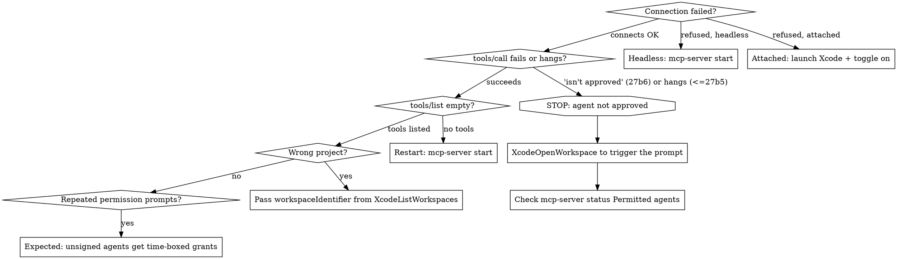

# Xcode MCP Setup

## Prerequisites

- **Xcode 26.3+** with MCP support
- **macOS** with Xcode installed

Two modes, and they differ in what else you need:

| Mode | Needs | Xcode.app running? |
|------|-------|--------------------|
| Attached (26.3+) | a project open in Xcode, Intelligence toggle on | Yes |
| Headless `OS27` | a one-time `sudo` opt-in | No |

Pick attached when a human is already working in Xcode. Pick headless for CI, for agents that
shouldn't depend on a GUI session, or when you simply don't want Xcode up.

## Step 1: Authorize external agents

Agents you launch *outside* Xcode (Claude Code, Codex in Terminal) reach your project through the
MCP server Xcode provides. Authorize them first — the path depends on your mode.

### Attached mode

1. Open Xcode **Settings** (Cmd+,)
2. Select **Intelligence** in the sidebar
3. Under **Model Context Protocol**, turn on **"Allow external agents to use Xcode tools"**

Without this, `xcrun mcpbridge` connects but Xcode exposes no tools. Xcode alerts you when an external agent connects and when it's active, so you always know when an agent is driving your project.

### Headless mode `OS27`

`xcrun mcp-server` runs the tool service with Xcode.app closed. Enabling is a one-time `sudo`
step; everything after is unprivileged.

```bash
sudo xcrun mcp-server enable          # turn headless mode on
xcrun mcp-server start                # launch the service (no-op if already running)
xcrun mcp-server open /abs/MyApp.xcodeproj   # optional — agents can open workspaces themselves
xcrun mcp-server status               # verify; add --format json for machine-readable output
```

Winding down:

```bash
xcrun mcp-server stop                 # terminate the service
sudo xcrun mcp-server disable         # turn headless mode off
```

`enable` also accepts `--unsafe-always-allow-all-agents`, which skips per-agent approval and
shows a red menu-bar warning. Don't use it on a machine with anything you care about — it grants
every connecting agent full tool access to permitted workspaces.

Check state at any time:

```
$ xcrun mcp-server status
Permission: enabled
Permitted agents:
  D4902C63-…: unsigned /bin/zsh 5dc76732… (expires 2026-08-15 17:53:03 +0000)
mcp-server: running
Open workspaces: none
```

`Open workspaces: none` is a normal starting state — see Workspace Bootstrap in
`axiom-xcode-mcp (skills/xcode-mcp-tools.md)`.

## Step 2: Connect Your MCP Client

### Claude Code

```bash
claude mcp add --transport stdio xcode -- xcrun mcpbridge
```

Verify: `claude mcp list` should show `xcode` server.

### Codex

```bash
codex mcp add xcode -- xcrun mcpbridge
```

### Cursor

Create or edit `.cursor/mcp.json` in your project root:

```json
{
  "mcpServers": {
    "xcode": {
      "command": "xcrun",
      "args": ["mcpbridge"]
    }
  }
}
```

**Cursor-specific note (Xcode 26.x only)**: Cursor is a strict MCP client. On 26.x, mcpbridge
omitted `structuredContent` when tools declared `outputSchema`, violating the MCP spec, and the
fix was to proxy through [XcodeMCPWrapper](https://github.com/SoundBlaster/XcodeMCPWrapper):

```json
{
  "mcpServers": {
    "xcode": {
      "command": "/path/to/XcodeMCPWrapper",
      "args": []
    }
  }
}
```

**Fixed on Xcode 27** — all tools declare `outputSchema` and responses carry `structuredContent`.
Configure Cursor with plain `xcrun mcpbridge` like every other client; adding the proxy on 27 buys
nothing. If a strict client still rejects responses on 27, look elsewhere.

### VS Code + GitHub Copilot

Create or edit `.vscode/mcp.json`:

```json
{
  "servers": {
    "xcode": {
      "type": "stdio",
      "command": "xcrun",
      "args": ["mcpbridge"]
    }
  }
}
```

### Gemini CLI

```bash
gemini mcp add xcode -- xcrun mcpbridge
```

## Step 3: Verify Connection

After configuration, call `XcodeListWorkspaces` (no parameters). You should see:

```
* workspaceIdentifier: workspace-Gxw7GRzGoI, workspacePath: /path/to/YourProject.xcodeproj
```

`No workspaces are currently open.` means the connection works and nothing is loaded. In attached
mode, open a project in Xcode. In headless mode that's the expected starting state — open one with
`xcrun mcp-server open <path>` or have the agent call `XcodeOpenWorkspace`.

If the call comes back rejected with *"This agent isn't approved to use Xcode's tools yet"* — or, on
beta 5 and earlier, **never returns at all** — see Permissions below. Both mean the same thing: the
agent has not been approved.

## Permissions

### Attached mode

When an MCP client first connects, Xcode shows a **permission dialog** identifying the connecting
process by **PID** and asking to allow MCP tool access. It must be approved in Xcode's UI, not the
terminal. Permission is per-process, so a client restart (new PID) prompts again — expected.

### Headless mode `OS27`

Same consent model, different surface. The dialog is owned by `XcodeService`, and grants are
managed with `sudo`:

```bash
sudo xcrun mcp-server approve <id> --for-24-hours   # or --always
sudo xcrun mcp-server allow-folder /path/to/Projects --for-24-hours
sudo xcrun mcp-server deny <id>                     # pending request, agent, or folder
sudo xcrun mcp-server clear-permissions             # revoke everything
```

Get the `<id>` from `xcrun mcp-server status`.

**An unapproved agent is rejected, not served — and beta 6 changed how loudly.** Through beta 5 this
was the biggest headless trap: `initialize` succeeded and returned full `serverInfo`, then the first
`tools/call` hung indefinitely with no error and no timeout, while `mcp-server status --format json`
reported `running: true` with **no** pending-request field. On a headless or CI machine nobody saw the
dialog, so the agent waited forever.

Beta 6 returns a descriptive error instead, and it names the fix:

```
This agent isn't approved to use Xcode's tools yet. Call XcodeOpenWorkspace or XcodeNewProject
first: opening or creating a project is what asks the user to approve this agent, together with
access to that project's folder. Run `xcrun mcp-server status` to check it, then retry.
```

Two things follow. **`tools/list` is not gated** — it answers fully for an unapproved agent, so a
successful tool listing is not evidence you can call anything. And **approval is requested by
`XcodeOpenWorkspace` / `XcodeNewProject`**, not by connecting: opening or creating a project is the
act that prompts the user, and it grants the agent *and* that project's folder together.

**Before issuing tool calls, confirm your agent appears under `Permitted agents` in
`xcrun mcp-server status`.** Its output also lists `Permitted folders` and `Open workspaces`:

```
Permission: enabled
Permitted agents:
  328846EC-…: signed Q6L2SF6YDW com.anthropic.claude-code
Permitted folders:
  2BC53B43-…: /path/to/project
mcp-server: running
Open workspaces: none
```

**Unsigned agents cannot hold durable trust.** A shell-launched client (`/bin/zsh`, `/bin/bash`)
gets a time-boxed grant even when you click "Always allow" — matching `approve --help`, where
`--always` is documented as "signed agents and folders only". Expect to re-approve roughly daily;
that is not a bug. For unattended use, either run a signed agent binary or accept the
`--unsafe-always-allow-all-agents` tradeoff described in Step 1.

## Letting Xcode Launch the Agent (`run-agent`)

Instead of wiring the agent yourself (Step 2), have Xcode launch it *with Xcode's own configuration* — resolved binary path, auth tokens, environment, and the Xcode MCP tools, all injected for you. `run-agent` connects to the running Xcode (same `MCP_XCODE_PID` auto-detection as the bridge), fetches the agent's config, then `exec`s the agent with full terminal access.

```bash
# Launch Claude Code, configured by the running Xcode
xcrun mcpbridge run-agent claude

# Pass args straight through to the agent
xcrun mcpbridge run-agent claude --model opus -p "fix the failing test"

# Print the resolved command without running it
xcrun mcpbridge run-agent --dry-run claude

# Launch without injecting Xcode's MCP tools
xcrun mcpbridge run-agent claude --no-xcode-tools
```

**`xcrun agent` is a top-level alias for `xcrun mcpbridge run-agent`** `OS27`. Both spellings
work — `agent --help` reports its usage as `mcpbridge run-agent` — and Apple's own examples have
moved to the short form. Prefer `xcrun agent` in new material.

Use `run-agent` when you want one command that both authorizes and starts the agent against the open project, rather than maintaining a separate `mcp add` registration.

### Exporting Xcode's Skill Bundles `OS27`

Xcode ships built-in skill bundles — the expertise it injects for tasks like localization and accessibility. Export every globally available `SKILL.md` bundle to disk to inspect what guidance Xcode's agent works from, or to reuse those bundles elsewhere:

```bash
xcrun agent skills export                                   # writes ./xcode-skills
xcrun agent skills export --output-dir ~/skills --replace-existing
```

**`--output-dir` must be absolute.** A relative path resolves against `/`, not the working
directory, so `--output-dir my-skills` fails with `NSFilePath=/my-skills` and *"the volume
'Macintosh HD' is read only"*. A missing directory is created for you, so absolute-and-nonexistent
is fine. The long form `xcrun mcpbridge run-agent skills export` remains valid.

Xcode 27 ships 10 bundles, each a `SKILL.md` plus a `references/` directory:

```
adopt-c-bounds-safety           app-intents-specialist    app-intents-whats-new-27
audit-xcode-security-settings   device-interaction        modernize-tests
building-document-based-swiftui-applications
swiftui-specialist              swiftui-whats-new-27      uikit-app-modernization
```

## Multi-Xcode Targeting

Applies to **attached mode**, where the bridge must pick an Xcode process. Under headless mode
there is no Xcode process to disambiguate — `mcp-server` is the single service, and you select the
*workspace* instead with `workspaceIdentifier` (see
`axiom-xcode-mcp (skills/xcode-mcp-tools.md)`).

Set `DEVELOPER_DIR` in your client config when you need to pin which Xcode's `xcrun` is used —
that is the lever that matters when a release Xcode and a beta are both installed.

### Auto-Detection (default)

mcpbridge auto-selects using this fallback:
1. If exactly one Xcode process is running → uses that
2. If multiple → uses the one matching `xcode-select`
3. If none → headless `mcp-server` serves the connection if enabled and running; otherwise errors

### Manual PID Selection

Set `MCP_XCODE_PID` to target a specific instance:

```bash
# Find Xcode PIDs
pgrep -x Xcode

# Claude Code with specific PID
claude mcp add --transport stdio xcode -- env MCP_XCODE_PID=12345 xcrun mcpbridge
```

### Session ID (optional)

`MCP_XCODE_SESSION_ID` provides a stable UUID for tool sessions, useful when tracking interactions across reconnections.

## Troubleshooting



### Common Issues

| Symptom | Cause | Fix |
|---------|-------|-----|
| **`tools/call` rejected: "This agent isn't approved…"** (beta 6) or **hangs forever, no error** (through beta 5) | Agent not approved | Call `XcodeOpenWorkspace` to trigger the prompt; confirm under `Permitted agents` in `xcrun mcp-server status`; or `sudo xcrun mcp-server approve <id>` |
| "Connection refused" (attached) | Xcode not running or MCP toggle off | Launch Xcode, enable MCP in Settings > Intelligence |
| "Connection refused" (headless) | Service not running, or headless never enabled | `xcrun mcp-server status`; then `xcrun mcp-server start`, or `sudo xcrun mcp-server enable` first |
| tools/list returns empty | Server not reachable — **not** approval: beta 6 lists all 54 tools to an unapproved agent | `xcrun mcp-server status`; restart with `xcrun mcp-server start` |
| `DocumentationSearch` missing from tools/list | Tool set is dynamic (`listChanged: true`) — but on beta 6 all 54 list with no workspace open | Re-list; if still missing, check `xcrun mcp-server status` |
| "workspaceIdentifier is required" | Identifier omitted — required even with one workspace open | Use the identifier the error itself lists, or call `XcodeListWorkspaces` |
| Tools target wrong project | Multiple workspaces open | Call `XcodeListWorkspaces`, pass the right `workspaceIdentifier` |
| Repeated permission prompts | Unsigned agents get time-boxed grants; "Always allow" still expires | Expected — re-approve, or run a signed agent binary |
| Cursor/strict client errors | Missing `structuredContent` — **Xcode 26.x only** | 26.x: XcodeMCPWrapper proxy. 27: fixed, don't add the proxy |
| "No such command: mcpbridge" | Xcode < 26.3 | Update to Xcode 26.3+ |
| "No such command: mcp-server" | Xcode < 27 | Headless mode is 27-only; use attached mode on 26.x |
| Server unresponsive after a stuck call | A blocked call stalls the session | `xcrun mcp-server stop && xcrun mcp-server start` |
| Slow tool calls | Large project indexing | Wait for indexing to complete |

## Extending the Agent That Runs Inside Xcode

Agents you launch *in* Xcode — the coding assistant, or one started with `run-agent` — can be customized beyond Intelligence settings. These customizations affect only Xcode-launched agents, **not** external clients you wired in Step 2.

**Per-agent config files** live in subfolders of `~/Library/Developer/Xcode/CodingAssistant` (a folder Xcode uses exclusively). Use them to set a default model, add your own MCP servers, or define skills:

```
~/Library/Developer/Xcode/CodingAssistant/ClaudeAgentConfig   # Claude
~/Library/Developer/Xcode/CodingAssistant/codex               # Codex
~/Library/Developer/Xcode/CodingAssistant/gemini              # Gemini
```

**Permissions** — Intelligence settings → **Agents → Permissions**. Add command-line tools under *Allowed Commands*; revoke tools under *Allowed Tools*. Anything you previously granted in the coding assistant appears here.

**Built-in skills via slash commands** — type `/` in the message field to list them. `/plan` enters plan mode (explore without editing code); `/exit` → `/exit-plan` leaves it. Xcode also invokes skills automatically from your prompt (e.g. a "translate" prompt triggers localization subagents).

**Plug-ins** — Intelligence settings → **Agents → Plug-ins → Add Plug-in**. A plug-in bundles additional subagents, MCP servers, and skills; "Add from URL" imports one, then you select which components to install.

## Resources

**Docs**: /xcode/mcp-server, /xcode/giving-external-agents-access-to-xcode, /xcode/extending-and-customizing-agents, /xcode/coding-intelligence

**WWDC**: 2026-258, 2026-259

**Skills**: axiom-xcode-mcp (skills/xcode-mcp-tools.md), axiom-xcode-mcp (skills/xcode-mcp-ref.md)
