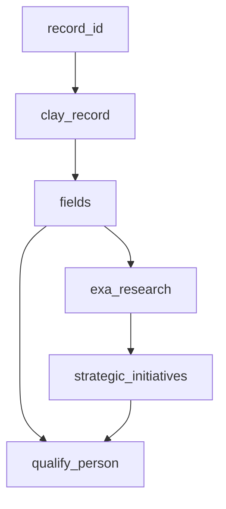

# Clay → Deepline Migration

> **Deprecated recipe.** It converts Clay tables to the deprecated `deepline
> enrich` surface. Convert Clay tables to custom plays instead: one
> `withColumn` per Clay column, per [deepline-plays.md](deepline-plays.md).
> The action-mapping tables below remain useful for choosing the equivalent
> Deepline tool per Clay action.

## Choosing your migration target

Every migration targets a Deepline play. The shape differs by table:

| Signal in Clay table                                                    | Target play shape                                                      |
| ----------------------------------------------------------------------- | ---------------------------------------------------------------------- |
| Batch rows, no triggers, one-time or manual re-runs                     | CSV-input play: one `.withColumn(...)` per Clay action (this recipe)   |
| **Function (subroutine) table**: a `f_subroutine_source` "Function inputs" field + a `write-to-cell` action | **Reusable play with a typed input contract:** input = the subroutine's declared parameter row (not a lead CSV), one `.withColumn(...)` per non-source field, output = the `write-to-cell` `data` map. Drop `write-to-cell`. See the Clay Functions section in [clay-extraction.md](../references/clay-extraction.md). |
| Webhook trigger, row routing (`route-row`), CRM writes, campaign pushes | Custom play with triggers/orchestration → [deepline-plays.md](deepline-plays.md) |
| Hybrid: batch enrichment + downstream push to CRM/campaign              | CSV-input play first, then a second play for the push                  |

Most Clay tables are batch tables. This recipe covers that path end-to-end;
for trigger/routing tables, **Extraction and Documentation still apply** — then
follow [deepline-plays.md](deepline-plays.md) with the extracted config as the
source artifact.

**Recognize a Clay Function before you plan the migration.** If the extract has a
`type: "source"` field named "Function inputs" (`f_subroutine_source`) and a
`write-to-cell` action, the table is a reusable subroutine, not a batch lead
list. Its input is the caller's parameter row — every column reads
`{{f_subroutine_source}}?.["<Input Name>"]`, and the `write-to-cell` `data`
`formulaMap` is the output schema. Migrate it as one self-contained play with
that input contract and drop the Clay-internal `write-to-cell` write-back; a
Deepline play returns its columns directly. The extraction reference's **Clay
Functions (subroutine tables)** section has the full signature and the
input/output/body capture map — read it whenever these signals appear.

---

## §1 Extraction

If you need to extract from Clay (no extract JSON provided), read [clay-extraction.md](../references/clay-extraction.md) for MCP and script-based extraction paths, API endpoints, config structure, and input data formats.

The full observed Clay internal API - every endpoint, plus how to pull the 1398-action catalog with input/output schemas - is in [clay-api-surface.md](../references/clay-api-surface.md). Go there when an `actionKey` is not covered by the mapping table, when you need a table's source filter criteria, or when you want a workbook's real dependency graph instead of deriving one.

If the user already provided an extract JSON or Clay export, skip to §2.

---

## §2 Phase 1: Documentation (Always First)

Produce before writing any scripts. Get user confirmation before Phase 2.

### 2.1 — Table Summary

| #   | Column Name | Clay Action | Tool/Model | Output Type | Notes |
| --- | ----------- | ----------- | ---------- | ----------- | ----- |
| 1   | `record_id` | built-in    | —          | string      |       |
| …   |             |             |            |             |       |

### 2.2 — Dependency Graph (Mermaid)



Use `classDef` colors: blue = local (`run_javascript`), orange = remote API, green = AI (`deeplineagent`).

### 2.3 — Pass Plan

**Column alias rule:** Derive aliases from the actual Clay column name, snake_cased (e.g. "Work Email" → `work_email`). The two structural aliases `clay_record` and `fields` are fixed — all others follow the Clay schema. Do NOT invent names from a memorized list.

```markdown
| Pass | Column alias     | Deepline tool                 | Depends on     | Notes                                      |
| ---- | ---------------- | ----------------------------- | -------------- | ------------------------------------------ |
| 1    | clay_record      | shell fetch (`clay_curl`)     | record_id      | Loaded into the seed CSV before enrichment |
| 2    | fields           | run_javascript (flatten)      | clay_record    | alias is always fields                     |
| N    | <clay_col_snake> | <see clay-action-mappings.md> | <prior passes> | Alias = snake_case(Clay column name)       |
```

**Function (subroutine) tables use a different pass-1.** There is no lead CSV to
fetch — the input IS the caller's parameter row. Skip the `clay_record`/`fields`
fetch-and-flatten passes and make pass 1 the input contract: one alias per
declared parameter (from `SUBROUTINE_INPUTS`, or the distinct
`{{f_subroutine_source}}?.["…"]` references when `tableSettings` is absent),
sourced from the play input rather than a Clay fetch. Then one pass per
non-source, non-`write-to-cell` field in dependency order. The final "pass" is the
output projection = the `write-to-cell` `data` map; do not build a
`write-to-cell` pass.

```markdown
| Pass | Column alias     | Deepline tool                 | Depends on     | Notes                                          |
| ---- | ---------------- | ----------------------------- | -------------- | ---------------------------------------------- |
| 1    | <param_snake>    | play input                    | —              | One per SUBROUTINE_INPUTS parameter            |
| N    | <clay_col_snake> | <see clay-action-mappings.md> | <prior passes> | Non-source, non-write-to-cell fields, in order |
| out  | (projection)     | —                             | prior passes   | = write-to-cell `data` formulaMap; not a pass  |
```

### 2.4 — Assumptions Log

State every unverifiable assumption. Get confirmation before Phase 2.

### 2.5 — Prompt Extraction

**Do this before writing any prompt approximations.** Actual Clay prompt templates live in formula field cell values or in `typeSettings.inputsBinding`.

**Prompt recovery priority (richest to weakest):**

1. **HAR** — bulk-fetch-records cell values rendered formula prompts verbatim. Use directly.
2. **clay-extract.py output** — `fields[].typeSettings.inputsBinding[name=prompt].formulaText` has the full prompt. Mark as `# RECOVERED FROM EXTRACT — field f_xxx`.
3. **ClayMate `portableSchema`** — `columns[].typeSettings.inputsBinding[name=prompt].formulaText`. Mark as `# RECOVERED FROM PORTABLE SCHEMA — field f_xxx`.
4. **Approximated** — reverse-engineer from outputs or user description. Mark as `# APPROXIMATED — could not recover`.

**JSON schema recovery from portableSchema:**

```python
import json
for col in d['portableSchema']['columns']:
    if col['type'] == 'action':
        for inp in col['typeSettings'].get('inputsBinding', []):
            if inp['name'] == 'answerSchemaType':
                schema_raw = inp.get('formulaMap', {}).get('jsonSchema', '').strip('"')
                schema_raw = schema_raw.replace('\\"', '"').replace('\\n', '\n').replace('\\\\', '\\')
                schema = json.loads(schema_raw)
```

**Fix Clay formula bugs in recovered prompts:** `{{@Name}}` → `{{name}}`, `{single_brace}` → not interpolated by Deepline, `Clay.formatForAIPrompt(...)` → strip wrapper.

### 2.6 — Pipeline Architecture Verification

Check actual cell values across 3+ records before counting AI passes:

| Cell value                              | Meaning                      | How to replicate                      |
| --------------------------------------- | ---------------------------- | ------------------------------------- |
| `NO_CELL`                               | Action never fired           | Build from scratch                    |
| `"Status Code: 200"` / `{"status":200}` | HTTP/webhook action — NOT AI | `generic_http_request` or shell fetch |
| `""` (empty string)                     | Disabled or unfired          | Treat as NO_CELL                      |
| Varied generation-shaped text           | Actual AI output             | `deeplineagent`                       |

**No cell data in the extract?** Some extracts carry config only (no
`exampleRecords` / `bulkFetchRecords`). You cannot run the 3-record check, so do
not fake it: infer architecture from `typeSettings` (`actionKey`,
`conditionalRunFormulaText`, `formulaWaterfall`) and label every architecture or
parity claim **`config-inferred, unvalidated`**. Defer any conclusion that
genuinely needs real cell values until you fetch records (§ `bulk-fetch-records`)
or the user confirms.

---

## §3 Phase 2: Pre-flight + Play Authoring

### Pre-flight Checklist

Answer these **before writing the play** based on what Phase 1 revealed. Only answer questions that apply.

**Table type (check all that apply):**

- [ ] **Has a provider waterfall** (several finders of the same kind chained by `conditionalRunFormulaText`) → ONE Deepline waterfall play, not one pass per provider
- [ ] Has phone columns → use `prebuilt/person-to-phone`; confirm the input contract, it needs name + domain while many Clay finders take only a LinkedIn URL
- [ ] Has person enrichment columns → verify with `deepline tools search "person enrichment linkedin"`. Check `inputsBinding` first: a column keyed `enrich-person` is often wired as a phone or email finder
- [ ] Has email finding columns → use `name-and-domain-to-email-waterfall` as primary play
- [ ] Has AI generation columns (use-ai, claygent, octave) → recover prompts verbatim (§2.5)
- [ ] Has scoring/qualification columns → use ICP criteria verbatim from Clay config
- [ ] Has campaign push / CRM update columns → verify with `deepline tools search "<platform> add leads"`
- [ ] Has cross-table lookups → export linked table to CSV first
- [ ] **Is a company intelligence table** (source = Mixrank) → use `crustdata_companydb_search`

**Security (all tables):**

- [ ] `CLAY_COOKIE` in `.env.deepline` (not hardcoded), single quotes, `.gitignore`d
- [ ] `output/` in `.gitignore`
- [ ] HTTP calls use `generic_http_request` or the generated shell fetch script; `run_javascript` is only for local row transforms

### Output Files

```
project/
├── .env.deepline             # Clay credentials (never commit)
├── .env.deepline.example     # Template — safe to commit
├── .gitignore                # Excludes .env.deepline, *.csv, output/
├── prompts/
│   └── <name>.txt            # One file per AI column with source header
├── scripts/
│   └── fetch_<table>.sh      # Fetches Clay records → seed_<table>.csv
└── <table>.play.ts           # The migrated table: one column per Clay action
```

### Cookie Pattern (mandatory)

```bash
set -a; source .env.deepline; set +a
: "${CLAY_COOKIE:?CLAY_COOKIE must be set in .env.deepline}"
CLAY_VERSION="${CLAY_VERSION:-v20260311_192407Z_5025845142}"

clay_curl() {
  curl -s --fail \
    -b "${CLAY_COOKIE}" \
    -H "accept: application/json, text/plain, */*" \
    -H "origin: https://app.clay.com" \
    -H "referer: https://app.clay.com/" \
    -H "x-clay-frontend-version: ${CLAY_VERSION}" \
    -H "user-agent: Mozilla/5.0 (Macintosh; Intel Mac OS X 10_15_7) AppleWebKit/537.36 (KHTML, like Gecko) Chrome/145.0.0.0 Safari/537.36" \
    "$@"
}
```

**Never hardcode `CLAY_COOKIE` in scripts.** Use single quotes in `.env.deepline` (GA cookies contain `$`).

**How to get the cookie:** Copy a `curl` from Chrome DevTools (right-click any api.clay.com request → Copy as cURL). Extract the `-b '...'` value.

### Clay API Endpoints

| What you need   | Correct endpoint                                        | Notes                                                              |
| --------------- | ------------------------------------------------------- | ------------------------------------------------------------------ |
| All record IDs  | `GET /v3/tables/{TABLE_ID}/views/{VIEW_ID}/records/ids` | View ID required — without it returns `NotFound`                   |
| View ID         | `GET /v3/tables/{TABLE_ID}` → `.table.firstViewId`      | Always fetch dynamically                                           |
| Fetch records   | `POST /v3/tables/{TABLE_ID}/bulk-fetch-records`         | Body: `{"recordIds": [...], "includeExternalContentFieldIds": []}` |
| Response format | `{"results": [{id, cells, ...}]}`                       | Key is `results`; record ID is `.id` (not `.recordId`)             |

### Play Shape and Column Order

The migrated table is a play file: the body reads the seed CSV with `ctx.csv(...)`, chains one `.withColumn(alias, ...)` per Clay action in dependency order, and finishes with `.run({ key })`. Author it per [deepline-plays.md](deepline-plays.md); columns execute in declaration order, and each column can read any earlier alias.

Validate before spending credits:

```bash
deepline plays check <table>.play.ts
```

`plays check` compiles the play and reports errors without starting a run. Order columns cheapest-first: `run_javascript` transforms before paid provider calls, so a local derivation is available to the columns that depend on it.

### Referencing Columns

Reference columns by alias, never by index. In a payload template, `{{alias}}` resolves to an earlier column or a seed CSV header.

Interpolation walks the full path: `{{fields.title}}`, `{{fields.company.name}}`, and array indices like `{{li_serper.organic[0].link}}` all resolve. A path that does not exist renders empty rather than erroring, so check a sample row when a value comes back blank.

### Running and Waiting

```bash
deepline plays run --file <table>.play.ts --input '{"csv": "seed.csv"}' --watch
deepline runs export <run-id> --out output_<table>.csv
```

`--watch` blocks until the run reaches a terminal state. To inspect fill rates on the export, `deepline csv show --csv output_<table>.csv --format json --summary` returns `columnStats` at the **top level** of the JSON (alongside `total_rows`), not nested under `_metadata`.

### Piloting A Subset Of Rows

Pilot on a slice of the seed CSV before the full run:

```bash
head -4 seed.csv > pilot.csv   # header + 3 rows
deepline plays run --file <table>.play.ts --input '{"csv": "pilot.csv"}' --watch
```

To skip rows a cheaper pass already answered, gate the expensive column with `runIf` so it only fires where the value is missing:

```ts
runIf: (row) => !row.work_email,
```

This replaces the old filter-to-a-separate-CSV-and-merge workaround. Tool receipts are content-addressed on tool + input, so re-running the play does not re-bill results it already bought.

### Architecture Choice: Play vs Python SDK

For Claygent-heavy tables, use a **pure Python script** with `deepline tools execute exa_search` + `deeplineagent`. Enables parallel execution with `ThreadPoolExecutor`, full retry/confidence control.

The play pattern still applies for non-AI passes and simple single-column `deeplineagent` enrichments — and unlike shell-assembled JSON, the play is a real TypeScript file: JS transforms live in the file directly with no quoting or escaping problems.

### Common Failure Modes

| Symptom                      | Cause                                          | Fix                                                    |
| ----------------------------- | ------------------------------------------------ | --------------------------------------------------------- |
| `{{col}}` empty in prompt    | Alias declared after the column that reads it  | Move the producing column earlier in the play          |
| Interpolation renders blank  | Path does not exist on that row (`{{a.b.c}}`)  | Check a sample row's actual shape; fix the path        |
| Unexpected re-charge         | Input value changed between runs               | Receipts key on tool + input; identical inputs reuse   |

---

## §4 Action Mapping

**Start with the job-based mapping table in [clay-api-surface.md](../references/clay-api-surface.md#map-by-job-not-by-provider-name).** Clay names one action per provider - 21 phone finders, 15 work-email finders - and those collapse into a single Deepline waterfall. Mapping provider-by-provider covers about 17% of real-table usage; mapping by job covers about 85%.

Then use [clay-action-mappings.md](../references/clay-action-mappings.md) for the exact CLI payload of a specific tool. It is a payload reference, not a complete action list: it has no phone or CRM rows. Always verify tool IDs before use.

For anything neither file maps, pull the action's real input schema from Clay's catalog (see [clay-api-surface.md](../references/clay-api-surface.md)), then map it. Do not guess from the action name.

### Unknown Action Fallback

```bash
deepline tools search "<what the action does>"   # search by intent
deepline tools describe <candidate_tool_id>       # inspect candidate
# if nothing found → deeplineagent fallback
```

| You see in Clay        | Search query               | Likely result                                   |
| ---------------------- | -------------------------- | ----------------------------------------------- |
| `enrich-person-with-*` | `"person enrich linkedin"` | `leadmagic_profile_search`                      |
| `find-email-*`         | `"email finder"`           | `hunter_email_finder`, `leadmagic_email_finder` |
| `verify-email-*`       | `"email verify validate"`  | `leadmagic_email_validation`                    |
| `company-*`            | `"company enrich"`         | `prospeo_enrich_company`                        |
| `add-to-campaign-*`    | `"add leads campaign"`     | `instantly_add_to_campaign`                     |

### Summary Table

| Clay action                                   | Deepline tool                                                                    |
| --------------------------------------------- | -------------------------------------------------------------------------------- |
| Email waterfall + `validate-email`            | `name-and-domain-to-email-waterfall` + `perm_fln` + `leadmagic_email_validation` |
| `enrich-person-with-mixrank-v2`               | `leadmagic_profile_search` → `crustdata_person_enrichment`                       |
| `chat-gpt-schema-mapper`                      | `deeplineagent` with `jsonSchema`                                                |
| `use-ai` (no web)                             | `deeplineagent`                                                                  |
| `use-ai` (claygent + web)                     | Binary search optimizer — see §5                                                 |
| `octave-qualify-person`                       | `deeplineagent` + `jsonSchema` ICP scorer                                        |
| `add-lead-to-campaign`                        | `instantly_add_to_campaign` or `smartlead_api_request`                           |
| `route-row`                                   | **Not replicable.** Produce filtered output CSV per destination.                 |
| `find-lists-of-companies-with-mixrank-source` | `crustdata_companydb_search` + optional `prospeo_enrich_company`                 |

---

## §5 Binary Search Optimizer (Claygent Web Research)

Use whenever replicating a `use-ai (claygent + web)` column.

### Pass Structure

```python
# Pass A — parallel, highlights-only (cheap). Include domain in ALL queries.
queries = [
    f'"{co_name}" {domain} 10-K annual report investor relations',
    f'"{co_name}" {domain} new product launches announcements 2024 2025',
    f'"{co_name}" {domain} go-to-market new customer segments 2024 2025',
]

# Pass B — synthesis with confidence gate
schema = { ...fields..., "confidence": "high|medium|low", "missing_angles": [...] }
# confidence == "high": STOP

# Pass C — follow-up exa searches on missing_angles[0:2], text=True
# Pass D — re-synthesize
# Pass E — primary-source deep-read via _extract_primary_source_url(company_domain)
```

Always add `research_confidence` and `research_passes` tracking columns.

### Confidence Calibration (26-row data)

- `high`: 0% — essentially never with Exa
- `medium`: 35% — large public companies, funded startups
- `low`: 65% — but 50% of `low` had specific useful content

`low` ≠ bad output. Use `is_failed_research()` content quality check instead:

```python
FAILURE_MARKERS = ['UNCHANGED', 'UNRESOLVED', 'NO UPDATE', 'SOURCE INVALID',
                   'CRITICAL SOURCE MISMATCH', 'Unable to determine']
```

Expected failure rate: ~15%.

### Known Failure Modes

| Failure           | Example                         | Fix                                                      |
| ----------------- | ------------------------------- | -------------------------------------------------------- |
| Name collision    | `onit.com` → wrong company      | Quote `co_name`; add domain                              |
| No indexed source | `ziphq.com`                     | Fall back to Crunchbase + LinkedIn                       |
| URL contamination | Deep-read returns wrong company | Use `_extract_primary_source_url(company_domain=domain)` |

### Adapting Search Angles

| Use case            | Angle A              | Angle B             | Angle C          |
| ------------------- | -------------------- | ------------------- | ---------------- |
| GTM strategy        | 10-K / IR            | Product launches    | New segments     |
| Signal detection    | Tech stack / jobs    | Engineering blog    | Conference talks |
| Competitor research | Pricing pages        | G2/Capterra reviews | Exec interviews  |
| Private company     | Crunchbase / funding | Newsroom            | Founder blog     |

---

## §6 Patterns and Antipatterns

Clay-specific patterns. For general Deepline patterns (email plays, interpolation, deeplineagent, column shapes), follow `enriching-and-researching.md` from the deepline-gtm.

### Prompt Recovery

**Do this**: Extract from richest source (HAR > extract > portableSchema > approximate). Mark files with source header.

**Not this**: Approximate when the actual prompt was in the export.

### Email Match Rate

| Format                  | % of Clay emails |
| ----------------------- | ---------------- |
| `fn.ln@domain`          | 63%              |
| `fln@domain`            | 19%              |
| `fn@domain`             | 3%               |
| Provider waterfall only | ~12%             |

Use `name-and-domain-to-email-waterfall` as primary play. Accept `valid`, `valid_catch_all`, AND `catch_all` from validation (NOT `unknown`).

### Cookie Security

Read `CLAY_COOKIE` only in the generated shell script. Single quotes belong in `.env.deepline`. Add `.env.deepline` and `output/` to `.gitignore`. Never place the cookie in a play payload.

### run_javascript

`run_javascript` does not expose fetch or process.env. Use it for deterministic row transforms only. Route HTTP through `generic_http_request`, or fetch Clay records in `scripts/fetch_<table>.sh` with `clay_curl`. Column payloads live in the play file as real TypeScript, so no shell JSON assembly is needed.

### Clay API Calls

Always use `clay_curl` wrapper. Get `VIEW_ID` from `.table.firstViewId`. Parse with `.get('results', [])`. Record ID is `.id` not `.recordId`.

---

## §7 Phase 3: Validation

### Parity Thresholds

Base thresholds:

| Field type                               | Threshold                             |
| ---------------------------------------- | ------------------------------------- |
| Deterministic (formulas, fetch, scoring) | 100% exact match                      |
| LLM classification                       | ≥90% exact match on unambiguous cases |
| LLM generation                           | Tone and intent match (manual review) |

Clay-specific extensions:

| Field type                                  | Threshold                                    |
| ------------------------------------------- | -------------------------------------------- |
| Email (`work_email`)                        | DL found rate ≥95% of Clay found rate        |
| Structured (`deeplineagent` + `jsonSchema`) | All schema fields populated in 100% of rows  |
| Web research                                | `is_failed_research()` False on ≥85% of rows |

### Running the Comparison

```bash
python3 /path/to/skill/scripts/compare.py ground_truth.csv enriched.csv
python3 /path/to/skill/scripts/compare.py ground_truth.csv enriched.csv \
  --map '{"clay_final_email":"work_email","clay_job_function":"job_function"}'
```

### Accuracy Expectations

- **Valid/valid_catch_all**: high confidence (<5% bounce)
- **catch_all**: domain accepts all — best guess. Same limitation as Clay (same ZeroBounce under the hood)
- **unknown**: skip, do not treat as found

### Diagnosing LLM Mismatches

Use this mismatch process: check prompt parity → check model parity → check true ambiguity (run 3x) → document, don't overfit.

---

## §8 Critical Rules

- **Declaration order is execution order**: put `run_javascript` transforms before the paid columns that read them
- **Gate expensive columns with `runIf`**: never pay for a row a cheaper pass already answered
- **Flatten first**: a `run_javascript` column that flattens `clay_record` before `{{fields.xxx}}`. Not needed in Python SDK — use `json.loads()` directly
- **Interpolation walks the full path**: `{{col.field.nested}}` and `{{col.items[0].field}}` both resolve; a missing path renders empty, not an error
- **Structured JSON for deeplineagent**: Single invocation per column, all fields in one `jsonSchema`
- **Cookie in env**: Never embed `CLAY_COOKIE` in play code or payloads; read it only from `.env.deepline` in the generated shell fetch script
- **Catch-all is valid**: Accept `valid`, `valid_catch_all`, `catch_all`. NOT `unknown`
- **Prompts verbatim**: Use exact text from source — small differences cause systematic drift

---

## §9 Migration Checklist

1. **Extraction (§1)**: Extract Clay table config (or skip if user provides extract)
2. **Phase 1 (§2)**: Table summary, dependency graph, pass plan, prompt extraction, assumptions
3. **Confirm**: Get user approval on assumptions and pass plan
4. **Phase 2 (§3)**: Pre-flight → write `fetch_<table>.sh` + `<table>.play.ts`
5. **Pilot gate**: `deepline plays check` (compiles, no spend), then a 3-row pilot CSV (real APIs)
6. **Full run**: After pilot approval
7. **Phase 3 (§7)**: `compare.py ground_truth.csv enriched.csv` — confirm thresholds pass
8. **Trigger/routing migration** (optional): If table needs triggers/routing → [deepline-plays.md](deepline-plays.md)

### Pilot Gate

`run_javascript` needs no pilot. For paid tools, compile first, then run 3 rows, in that order:

```bash
deepline plays check <table>.play.ts                                        # step 1: compile only, no spend
head -4 seed.csv > pilot.csv
deepline plays run --file <table>.play.ts --input '{"csv": "pilot.csv"}' --watch   # step 2: 3 rows, real providers
deepline plays run --file <table>.play.ts --input '{"csv": "seed.csv"}' --watch    # step 3: all rows
```

`plays check` compiles the play without spending credits. It still calls the Deepline compile API, so it needs auth and network — it is not an offline check.
