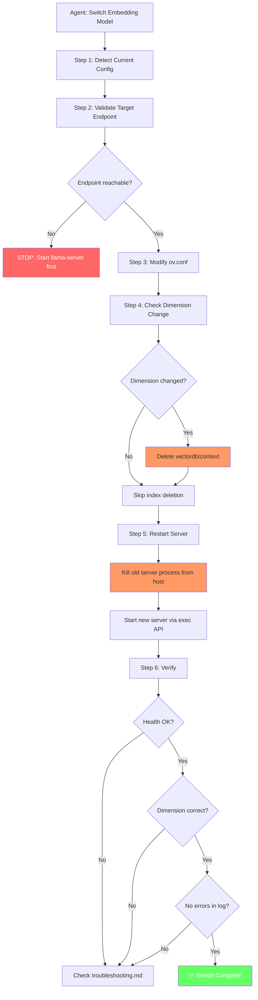
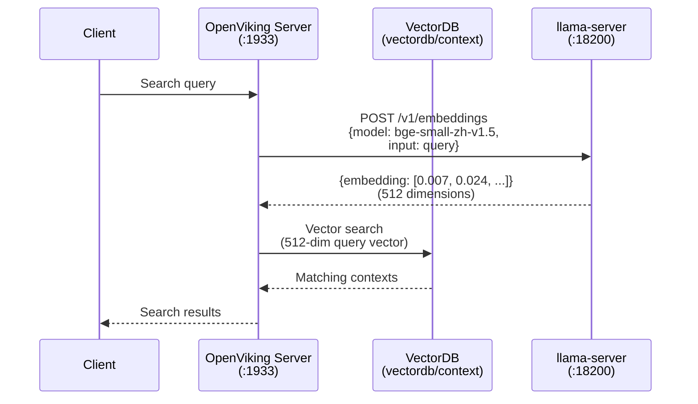
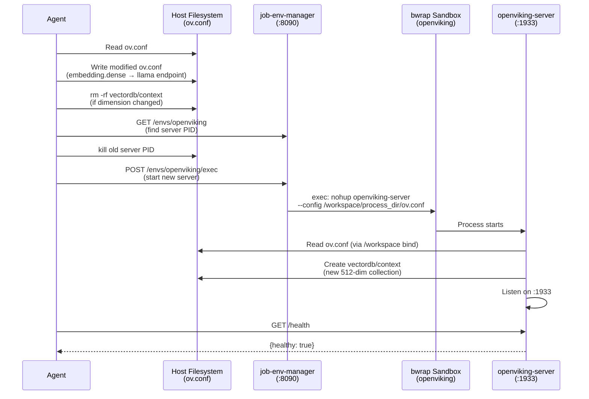

# Data Flow Diagram

```mermaid
flowchart TD
    A[Agent: Switch Embedding Model] --> B[Step 1: Detect Current Config]
    B --> C[Step 2: Validate Target Endpoint]
    C --> D{Endpoint reachable?}
    D -- No --> D1[STOP: Start llama-server first]
    D -- Yes --> E[Step 3: Modify ov.conf]
    E --> F[Step 4: Check Dimension Change]
    F --> G{Dimension changed?}
    G -- Yes --> H[Delete vectordb/context]
    G -- No --> I[Skip index deletion]
    H --> I
    I --> J[Step 5: Restart Server]
    J --> J1[Kill old server process from host]
    J1 --> J2[Start new server via exec API]
    J2 --> K[Step 6: Verify]
    K --> K1{Health OK?}
    K1 -- No --> K2[Check troubleshooting.md]
    K1 -- Yes --> K3{Dimension correct?}
    K3 -- No --> K2
    K3 -- Yes --> K4{No errors in log?}
    K4 -- No --> K2
    K4 -- Yes --> L[✅ Switch Complete]

    style D1 fill:#f66,color:#fff
    style L fill:#6f6,color:#fff
    style H fill:#f96
    style J1 fill:#f96
```

## Embedding Request Flow (Runtime)

```mermaid
sequenceDiagram
    participant Client as Client
    participant OV as OpenViking Server<br/>(:1933)
    participant VDB as VectorDB<br/>(vectordb/context)
    participant Llama as llama-server<br/>(:18200)

    Client->>OV: Search query
    OV->>Llama: POST /v1/embeddings<br/>{model: bge-small-zh-v1.5,<br/>input: query}
    Llama-->>OV: {embedding: [0.007, 0.024, ...]}<br/>(512 dimensions)
    OV->>VDB: Vector search<br/>(512-dim query vector)
    VDB-->>OV: Matching contexts
    OV-->>Client: Search results
```

## Config Update Flow

```mermaid
sequenceDiagram
    participant Agent as Agent
    participant FS as Host Filesystem<br/>(ov.conf)
    participant JEM as job-env-manager<br/>(:8090)
    participant Sandbox as bwrap Sandbox<br/>(openviking)
    participant Server as openviking-server<br/>(:1933)

    Agent->>FS: Read ov.conf
    Agent->>FS: Write modified ov.conf<br/>(embedding.dense → llama endpoint)
    Agent->>FS: rm -rf vectordb/context<br/>(if dimension changed)
    Agent->>JEM: GET /envs/openviking<br/>(find server PID)
    Agent->>FS: kill old server PID
    Agent->>JEM: POST /envs/openviking/exec<br/>(start new server)
    JEM->>Sandbox: exec: nohup openviking-server<br/>--config /workspace/process_dir/ov.conf
    Sandbox->>Server: Process starts
    Server->>FS: Read ov.conf (via /workspace bind)
    Server->>FS: Create vectordb/context<br/>(new 512-dim collection)
    Server->>Server: Listen on :1933
    Agent->>Server: GET /health
    Server-->>Agent: {healthy: true}
```
