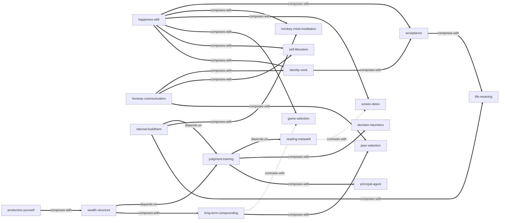

# 《纳瓦尔宝典：财富与幸福指南》 — Skill Index

> 本书由 cangjie-skill 蒸馏, 共产出 **19** 个 skills。
> 处理时间: 2026-08-01

## 关于这本书

- **作者**: 纳瓦尔·拉维坎特 (Naval Ravikant), 埃里克·乔根森 (Eric Jorgenson) 整理
- **出版年**: 2020 (素材 2008–2019)
- **一句话主旨**: 财富和幸福都是可以学习的技能——用「特殊知识 + 责任感 + 杠杆 + 判断力」创造财富，用「减少欲望 + 活在当下 + 接受现实」获得幸福
- **整书理解**: 见 [BOOK_OVERVIEW.md](./BOOK_OVERVIEW.md)
- **精华长文** (不读全书看这篇): [DIGEST.md](./DIGEST.md)
- **术语词典**: [GLOSSARY.md](./GLOSSARY.md)

---

## Skill 列表 (按主题分组)

### 财富创造

- [`productize-yourself`](./productize-yourself/SKILL.md) — 特殊知识发现 + 产品化：定位你的不可替代价值并规模化
- [`wealth-structure`](./wealth-structure/SKILL.md) — 责任→产权→杠杆→避免出局的财富结构
- [`long-term-compounding`](./long-term-compounding/SKILL.md) — 复利与长期游戏：选长期伙伴、积累声誉
- [`hourly-rate-time`](./hourly-rate-time/SKILL.md) — 高时薪时间分配、外包判据、退休定义

### 判断力与决策

- [`judgment-training`](./judgment-training/SKILL.md) — 判断力>努力、从基础重建、心智模型库
- [`principal-agent`](./principal-agent/SKILL.md) — 委托-代理识别：利益归属决定行为质量
- [`decision-heuristics`](./decision-heuristics/SKILL.md) — 无法决定就答否、三个重大决定、短期痛苦原则
- [`reading-metaskill`](./reading-metaskill/SKILL.md) — 阅读元技能：爱上阅读、原著优先、以教促学

### 幸福与心智

- [`happiness-skill`](./happiness-skill/SKILL.md) — 幸福=缺憾清空的默认状态、欲望管理、活在当下
- [`game-selection`](./game-selection/SKILL.md) — 识别地位游戏/财富游戏/单人游戏，回到内在记分卡
- [`acceptance`](./acceptance/SKILL.md) — 情境三选项：改变/接受/离开 + 正面重释
- [`self-liberation`](./self-liberation/SKILL.md) — 期望边界、愤怒解体、就业自由
- [`monkey-mind-meditation`](./monkey-mind-meditation/SKILL.md) — 心猴关停：调试模式观察念头、冥想
- [`screen-detox`](./screen-detox/SKILL.md) — 屏幕戒断与多巴胺管理
- [`peer-selection`](./peer-selection/SKILL.md) — 五只黑猩猩：主动选择同伴
- [`identity-work`](./identity-work/SKILL.md) — 身份清空看清现实 + 用自我形象改变自己

### 价值观与哲学

- [`honesty-communication`](./honesty-communication/SKILL.md) — 彻底诚实、具体表扬一般批评
- [`rational-buddhism`](./rational-buddhism/SKILL.md) — 验证一切：可证伪标准 + 保留内在技术
- [`life-meaning`](./life-meaning/SKILL.md) — 生命意义三答案、拥抱死亡

---

## 引用图



图例:
- `-->`  depends-on
- `-.->` contrasts-with
- `===>` composes-with

---

## 推荐学习顺序

1. **productize-yourself** — 起点：先回答「你是谁、做什么」
2. **reading-metaskill** — 供给特殊知识与判断力的输入管线
3. **judgment-training** — 判断力：方向 > 努力、从基础重建
4. **wealth-structure** — 把定位变成资产结构（责任/产权/杠杆）
5. **long-term-compounding** — 用复利与长期游戏放大
6. **principal-agent / decision-heuristics / hourly-rate-time** — 组织、决策与时间的即用工具
7. **happiness-skill → acceptance → monkey-mind-meditation → screen-detox → peer-selection → identity-work** — 幸福训练链
8. **game-selection / self-liberation / honesty-communication** — 关系与自由的校准
9. **rational-buddhism → life-meaning** — 哲学收尾

---

## 安装使用

本目录是构建产物, 宿主不会从这里加载 skill。要让 agent 真正调用, 把 skill 目录复制到宿主的 skills 目录:

```bash
# 用户级 (所有项目可用)
cp -r productize-yourself ~/.claude/skills/

# 或项目级
cp -r productize-yourself <project>/.claude/skills/    # Claude Code
cp -r productize-yourself <project>/.cursor/skills/    # Cursor
```

---

## 接入 darwin-skill

所有 skill 均带有 `test-prompts.json` (darwin-skill 兼容格式), 可直接接入自动进化:

```
darwin evolve books/naval-almanack-skill/
```

---

## 审计轨迹

- 候选单元池: [candidates/](./candidates/)
- 被淘汰的候选 (含原因): [rejected/](./rejected/)
- BOOK_OVERVIEW: [BOOK_OVERVIEW.md](./BOOK_OVERVIEW.md)
